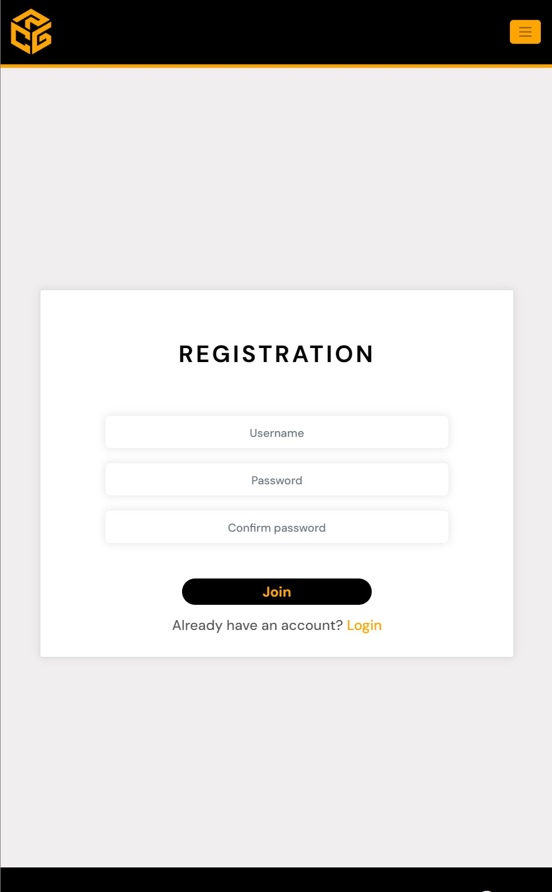
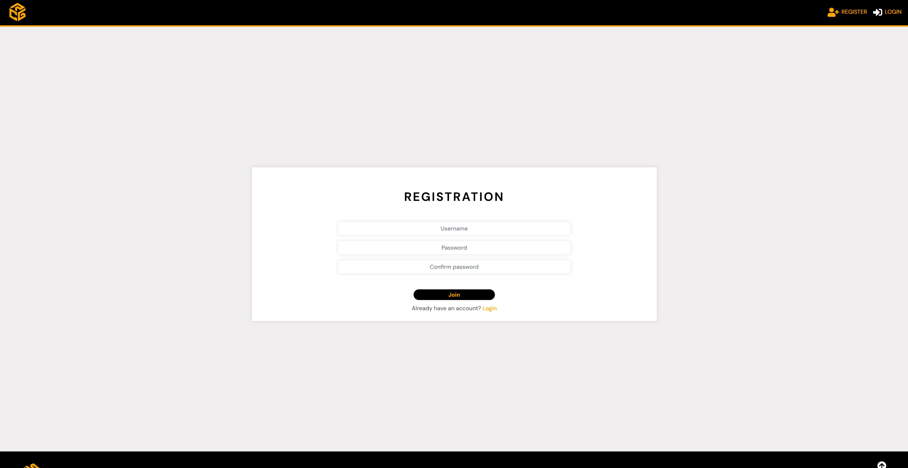
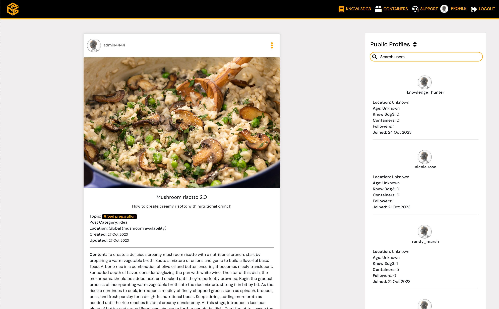
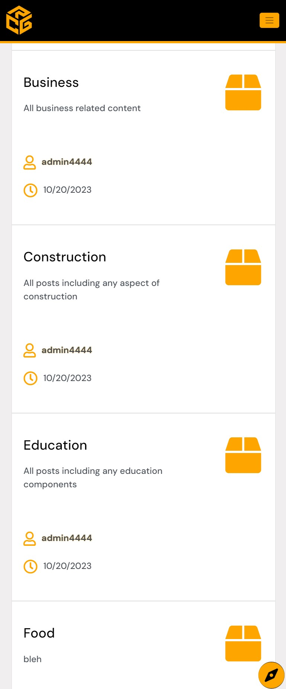
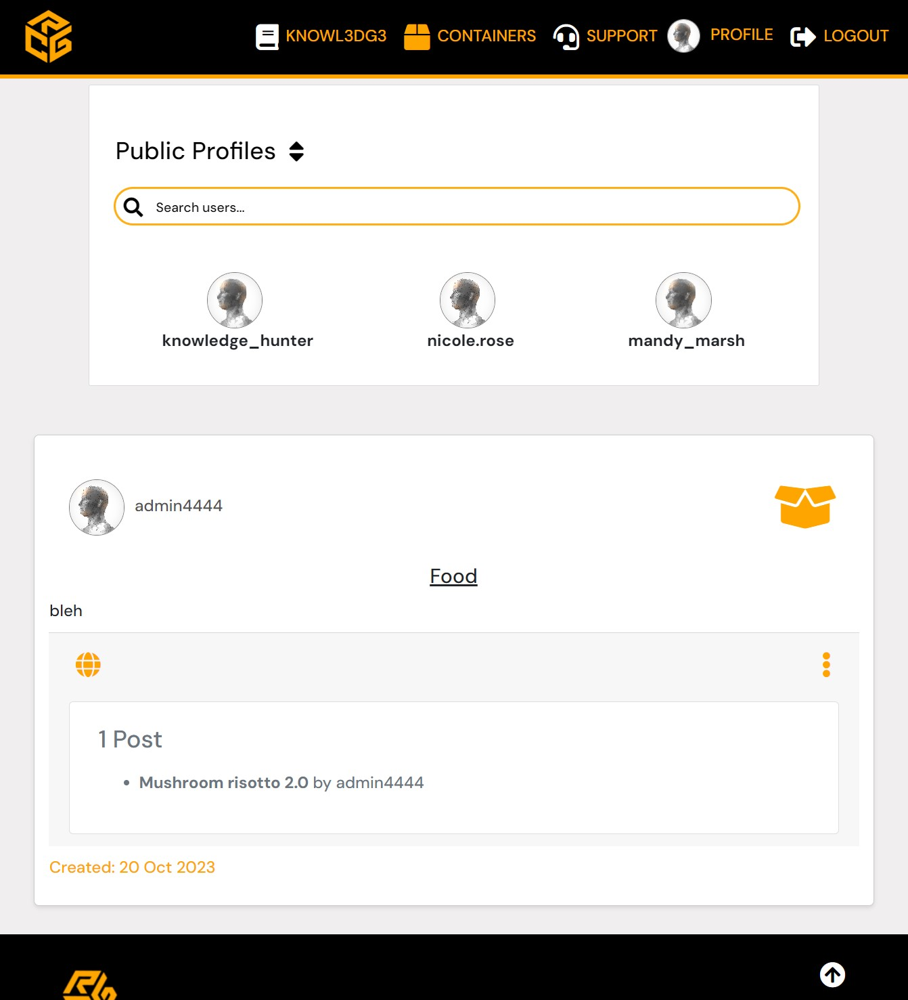

# [KNOWL3DG3 CONTAINERS](https://knowledge-front-end-1366ec6c3d29.herokuapp.com/) 

## [Front-End](https://github.com/bono-94/Project-5-Advanced-Front-End-Code-Institute) 

## INTRODUCTION

## Project Description

platform, and browser-based interface that allows users to create, view, edit, interact with, and delete knowledge placements and their' belonging containers. Any post while being created can be placed inside multiple containers which can help organize and categorize all content. It has been designed for its users to share their life's wisdom and experiences concisely, empowering, teaching, and inspiring the audience. All knowledge posts have their own pre-selected types ranging from ideas, stories, tutorials, journals, events, and many more. The entire application consists of the React app which is the front-end and an API app which is the back-end. Application Programming Interface (API) is created for the consumption of data by front-end applications, allowing users to allow users to store and manipulate data records. This solution is created for the purpose of public exposure to real-life global audiences, sharing and publishing global knowledge for common progress benefit. The advantage of the creation of any posts on this platform is to allow users to choose which information is important and relevant to be properly represented and presented online in range of large quantity of options. Besides creating posts, users and authors can also create entire containers, edit their visually appealing user profiles, or even send support requests. Whether you're an individual looking to share your expertise or a team collaborating on various projects, this platform offers a range of features and capabilities to meet any of your unique needs. In addition, we are your perfect partner if you aspire to make a meaningful impact around the globe through the convenience of the digital world. By creating posts and containers through this project, the user is the master owner of the information that truly matters and that will be used as a foundation for future projects, products, and services. Once payment methods are enrolled in v2.0, each knowledge purchase and sale will be given a percentage to charity as a donation, introducing the "learn-to-earn" and "teach-to-earn".            

 

 

## Project Purpose:

Due to the current global focus on individual benefits, the world needs a single meeting point for collective collaborative progress. Therefore this project is created in order to emphasize more day-to-day importance of knowledge units and bridging all aspects of human civilization life. The purpose of the Knowl3dg3 Containers project is to provide a fully built content-sharing web application with React and an API (Django Rest Framework) Back-End allowing users to enjoy interactive and content-based experiences. The platform should represent our vibrant community, with the possibility of getting involved with a versatile publishing tool. Users should have various options such as tools to create, view, edit, interact with, and delete content. The project aims to facilitate and inspire users to share their life's wisdom and experiences concisely while promoting inclusion, education, and excellence. The mission is to provide a global stage for sharing and publishing knowledge to benefit everyone on the planet. From a structural point of view, all data should be presented in a way that makes it easy for users to find what they're looking for. With UX Design in mind, the purpose has not been visually displayed to the user, instead, it is self-evident and implied. This project was started as a solution for a specific real-life business enterprise. The development team was contracted to create this first as the client's internal team training tool and product/service they can sell on the market. After multiple meetings to capture their vision, the need for specific custom solutions has only increased and the project was accepted. There was no limitation for the budget in terms of (financial) resources or time. Due to the NDA agreement and legal protection of the client's intellectual property, in the public version of README nothing further is allowed to be discussed. 

## Project Goals:

- GOAL 1: Develop concepts and features for an online community dedicated to global collaboration progress

- GOAL 2: Create a project that combines individually running, self-containing back-end and front-end

- GOAL 3: Allow CRUD functionalities for user-data interaction

- GOAL 4: Create a project that allows users to connect related or unrelated theories or topics

- GOAL 5: Create a safe, inclusive and healthy environment where user can share their life wisdom and experiences

## USER STORIES

## Business Case User Stories

- USER STORY 1:

  "As an innovator, I want to be able to share my ideas with the public in a way that allows me to build my online portfolio or database of inventions."

- USER STORY 2:

  "As an entrepreneur, I want to share announcements, events, and journals related to my organization, so that I can directly engage with the public and my own community."

- USER STORY 3:

  "As an investor, I want to be able to browse a catalog of knowledge posts and containers, so that I can get inspired for my next investment while potentially finding direct examples."

- USER STORY 4:

  "As an end-user, I want to be able to reach out to customer support, so that I can ask any content-related or technical-related questions with possibilities to give feedback and request specific knowledge."

- USER STORY 5:

  "As a publishing author, I want to write various high-quality knowledge posts with high word count as a service for organizations and innovators, while being able to share as much as possible information on my profile about myself for attracting further opportunities."

## Website User Stories

- ### [Full Website User Stories](https://1drv.ms/w/s!Al8IOkY8-S-8gcU_h3aamfQbttXXZw?e=gs18N6) 

## FEATURES

## Background
In the first demonstrative version, minimum features and their elements have been disclosed to create a rich experience for users over longer periods. Also, for legal protection and initial attention from investors, a large amount of information has been summarized to cover main topics and categories before planned full disclosure. This means all of our aspects will be expanded shortly, professional media uploaded and final legally protected branding released. We will continue to improve consistently while strategically releasing new content and features according to our planned agenda and the current state of users. This site is made fully responsive across a variety of devices with the lowest guaranteed working width of 320px and height of 640px considering older cellular models to establish full global presence.

## How it works?

- Users are welcomed by the landing home page where they can be introduced to the website and main elements
- Users can register
- Users can login/logout
- Users can navigate on the dashboard or navbar
- Users can access knowledge post lists and details, including creating, editing, and deleting
- Users can append multiple knowledge posts to multiple containers
- Users can like, favorite, or comment on knowledge posts
- Users can access private and public containers lists and details, including creating, editing, and deleting
- Users can view public profiles or their' own with the addition of editing
- Users can sort or search posts, containers, and profiles
- Users can send support requests

## Highlighted Key Features:

- Diverse Knowledge Posts:
  - The platform supports a wide variety of knowledge post types, including ideas, stories, tutorials, journals, events, and more. This diversity enables users to express their thoughts, insights, and experiences in structured and accessible formats.

- Multi-Container Compatibility:
  - Users have the flexibility to place their knowledge posts in multiple containers. This feature allows for effective content organization and categorization, making it easier for others to find, engage with, and benefit from your work.

- Concise Wisdom Sharing:
  - Knowl3dg3 Containers encourages users to share their life's wisdom and experiences in a properly sized and impactful way. It doesn't matter if you're an expert in your field or a newcomer; the platform provides a space for everyone to contribute with their unique perspectives with encouragement.

- Author Profiles:
  - Users can create and customize visually appealing user profiles. These profiles serve as a personal space for authors to showcase their work, connect with their audience, and establish their digital presence.

- Support Excellence:
  - Knowl3dg3 Containers offers a comprehensive support ticket system that allows users to efficiently address their concerns, seek assistance, or report issues. Users can choose from a range of support types, including booking consultancy, providing feedback, requesting specific knowledge, raising support tickets, or making suggestions to enhance the platform's functionality.

## Existing Features:

### DJANGO Admin Backpage

  - Feature of Django web framework
  - User-friendly interface
  - Manages all the content with full rights designated to selected trusted users (appointed admins)
  - Content can be created, edited or deleted from there without use of front-end forms
  - Interface can be customized allowing control over layout, display options, filtering options and shortcuts for functionalities such as as approving content
  - Credentials are allowed for specific users to access the admin panel 

---

### REST Back-end API admin page

  - Feature of Django REST web framework
  - User-friendly interface
  - Manages all the content with full rights designated to selected trusted users (appointed admins)
  - Same use as Django admin page but with different visual layout, putting emphasize on API and JSON without visual support
  - Content can be created, edited or deleted from there without use of front-end forms
  - In addition, content can be filtered, sorted, searched and paginated per demand
  - Interface can be customized in Python code allowing page admins to administrate over content with full control 

---

### Tab Icon & Name

  - Tab icon and name are essential expected elements that contribute to overall user experience by providing branding of the website
  - Tab icon appears next to text title so the user can differentiate where is the tab if a lot of them are open at the same time
  - Tab title provides description of the icons by adding a website name for all the users that might not be familiar with the brand yet

---

### Navigation Bar

  - The navigation bar is set fix at the top of every page
  - Navigation bar provides the user with shortcuts for accessing desired sections of the page
  - The navigation bar is intuitive and all types of users can navigate to the desired section without needing any further explanation
  - The main title is page logo made up of orange 3D cube with client's brand name "C.R.G" that takes the user back to the home page
  - The menu bar to the right of the logo is directing users to the main categories of the page: Knowl3dg3, Containers, Support, Profile, Login / Logout
  - If user is not authenticated, they can only see logo to take them to home page or 2 alternative options: Register and Login
  - On the larger screens, the menu is shown as full-width, while for tablet and phone sizes of screen, it is collapsed with toggle button  
  - Each page has "active feature" reversing color of belonging destination button informing user at all times where they are located. Default color of navbar icons is white, and while on active page or hovering over, icon becomes orange
  - Profile option does not have icon but user's actual profile photo that allows them to see login status if they are logged in and under which user at all times. Hovering over "Profile" adds small box shadow around profile picture in order to 
  - Background color of navbar is black which is one of the 2 main colors next to orange of the page being structural and navigational focused per your(client) request
  - Navbar is fully responsive on all screens and takes width of the entire screen at all times
  - Under the Navbar is an orange border that goes together with navigation button's font color and 3D cube logo

---

### Footer

  - First part of the footer focuses on the client's 3d spinning logo, address and contact information
  - The footer section also includes links to the selected few social media sites for Knowl3dg3 Containers.
  - The social media links from icons will open into a new tab to allow easy navigation for the user and to keep our site always open. . 
  - Copyright segment offers direct information on the copyrighted status of the website and the year
  - There is an icon with arrow up that can take user to the top of the page
  - Footer has been made to match navigation bar when user can see both of them on the screen by scrolling down to the bottom of the page
  - Same background color, font color and icon color
  - Biggest difference is that on footer, logo icon spins slowly clockwise adding more interactive and non-static experience
  - Hover on icons is also different from navigation bar to keep those 2 elements unique in their own ways, color is the same where footer has additional circular border with shadow effect
  - Footer is fully responsive and always taking 100% of the screen width
  - Area between footer and navigation bar is where all content can be found
  - Compass icon that appears on mobile and tablet screen does not cover any important contact information while on larger screens it doesnt appear on footer giving different look than on mobile evenw with different alignment of social media icons and their sizes

---

### Alerts

  - Alerts are informing user of changes within their data if there was an error or success
  - Success alerts are positioned on the home page in order to give user consistent experience and one page break from previous task and let them re-calibrate before proceeding either to public containers after creating knowledge, or maybe even editing name of the container after creating new knowledge post
  - This is the reason all success alerts take user to the home page that is purposely designed around this rule where user does not want to see every time they do something welcome media or video. They need simple welcome board with quick decision to make out of 2 boxes
  - Success alerts come from created, edited or deleted knowledge posts, containers, profile or support
  - Each alert has black background and orange font to support other navigational constant static components
  - Each alert has timeout of 8 seconds to give even slow readers chance to read with optional close button for fast readers
  
  - Warning Alerts are lighter shade of orange that is content-related color 
  - Displays interactive and closeable message to users triggered by custom conditions such as which issues user has encountered and how solve it
  - Simple alert box streatches most of the width of the form in order to completely separate itself from success messages deliberately not being green. It also alsows users to immediately identify which field has an issue without possibilities overlooking and scrolling the form once it starts scaling-up

---

### Login

  - Login page is one of the critical components for website authorization and security
  - Guards non-authenticated users from accessing any website information
  - Users can enter their credentials through previously selected username and password
  - There is also a "Register" button for users that do not have an account yet
  - Form is fully responsive and following identical styling as all other forms on this page for smooth user experience and website consistency with strategic development and UX design intent.

---

### Register

  - Registration page is second critical component for website authorization and security
  - It allows users to create an account in order to browse and engange with the main content
  - User can select their username if not existing in the database already
  - In addition, user can choose any password to protect their account with requiered confirmation
  - If user already has an account this page, suggested link at the bottom takes user to the login page
  - Form is fully responsive and following identical styling as all other forms on this page for smooth user experience and website consistency with strategic development and UX design intent.

---

### Home

  - First point of actual content interaction with users visiting application
  - Provides brief overview and sets expectations
  - It captures immediately attention of the user with the unique design
  - It allows them to navigate further and read more about the website and concept before proceeding to main content
  - Text had to be concise with only useful general information taking into consideration global audience with different characteristics
  - It helps building brand and relate to users better
  - No landing media due to often returning to the index, especially for all alerts to prevent oversaturation with same landing media
  - User is able to view 3 separate sections:
    - Welcome message in the orange (content-focused) container with introduction to the platform
      - fits tight on small screens and has a lot of spacing around in larger screens per clients decision on our request for preference
      - keeps the largest font title on the page to establish the header feeling without hero image
      - no further media being technology-focused website in v2.0
    - Decision cards where 2 main features of the website are described: containers & knowledge
      - Second point of user interaction
      - Divides visually content into 2 directions
      - Provides specifics on the each direction and what users can expect there
      - If user is logged in they can see buttons to take them to those sections
      - If user is logged out, they cannot see navigational buttons to main sections since they do not have access to those or navbar icons
      - Both cards were styled in black background(navigational) with content being orange font to contrast the welcome card above
      - All titles with belonging icons are colored white for sharp output and not being fused into orange content below
      - Both cards contain introduction to the main categories with their types and benefits for the users
      - On mobile and tablet screens, both cards are placed above each other for readibility purpose with navigation buttons centered taking almost entire width of the card
      - On larger screens than that, due to more space, cards are placed next to each other for comparison and easier decision making and to prevent too much scrolling. 
      - Navigation button now takes less than 50% of the card width aligned all the way to the right under the benefits, having name on the button "Select" so it makes it seem like user is "selecting" benefits named above it
      - Font-sizes are fully responsive to any screen size accordingly
      - Icons always take their row without fusing with title in orded to prevent same look as navigation bar and further distinction of content
    - Support information section
      - It contains 3 sections: Introduction message by customer support, 24/7 support information, and community forum information
      - Entire support section being the last on the home page and closest to the footer and content-focused is being styled with orange background and black font
      - The titles of sub-sections are much larger than their content for clear distinction of content
      - On mobile devices and tablets, all sub-sections are structured under each other
      - On larger screens main message is always above the 2 other sub-sections being next to each other showing they are 2 possibilites of introduction message with a lot of padding around all 3 sections centered inside it not having to stretch all the content across the entire large PC monitor for example
      - Both 24/7 Support and Community Forum icons are black as content but on hover turning white to indicate it is a link also
      - 24/7 Support takes user immeditely to Support page, while Community Forum takes user to list of all posts where they can choose one and interact with community live on the comments

---

### Support

  - Support page is the most important component for website's customer experience
  - It creates UX effect of constantly being there for the user assuring confidence and solutions to any doubts
  - Only users with account can access the support page. If not user and manually types /support to the URL link, user gets pushed to the home page
    - Prevention of form abuse and easier identifier of who tried to overload the page with infinite support requests
  - It also allows automatic identification of request owner without having to enter personal information every time
  - Users can first identify type of support they need having options from:
    - Consultancy - book a session with one of the experts on content topic or technological advisor
    - Feedback - give personal opinion to the website about design, features quality and experience as user
    - Request Knowledge - ask the portal to source specific knowledge for your containers
    - Support Ticket - report any problems, issues, concerns and more...
    - Suggestion - offer any advices, tips and ideas for improving the website or content in any way possible
  - Users are then asked to give a title to their request to reach correct department next to writing the full content of the Support Form in textarea offering large quantity of input words and readibility
  - Finally, at the end user can indicate which exact knowledge post or container is the form support about
  - Additional benefit of the form is that it can serve as flexible solutions to any break in smooth user experience
  - Without the proper always available support user would be demotivated pretty quickly once they encounter the UX "wall"
  - This way we covered any possible additional feature and inconsistency that user might even personally expect and offer alternative to inform us about it so we can add functionality for them if necessary
  - Form also can serve as re-population of containers per individual knowledge. Since user can only select containers when creating knowledge but not in editing form, they are advised to contact support when they want to append or remove containers. This creates overall more trusteable content preventing abuse and constant changes and misinformation having all content modification going first through admins and support team for approval.
  - Form is fully responsive and following identical styling as all other forms on this page for smooth user experience and website consistency with strategic development and UX design intent.

---

### Public Profiles List

 - Component that occurs the most on other pages next to knowledge posts
 - It serves the purpose of constantly allowing users second choice or second direction besides main scrolleable content. For example if user is scrolling posts for long time and opens interesting one, it will show details and comments and user would have nowhere to go "next". Only back. For that reason this component always gives alternative scrolling profile, knowledge or containers page to go and visit someone else's work
 - The component consists of title, sort icon, search bar and profiles
 - Sort icon on clicks creates dropdown list of all potential sorting combinations, ascending and descending both on age, location, knowledge count, containers count, followers count, date joined
 - Search bar allows user to find profiles matching their input value being for username, first name, contents of profile quote and bio summary, exact age, location or website
 - On mobile and tablet devices output is slightly different than on larger devices being positioned under the nav bar, centered and taking most of width of a screen. It also only displays 3 profiles at the time only with profile image and username
 - On larger screens than that, everything is identical besides positioning of course of the component always found on the right side of the screen taking full height of the screen but only under 33% of the screen of width. In addition to picture and username, additional values are shown such as location, age, posts and conteiners count, followers count and date joined. There is no limitation of only 3 profiles. Now profiles became infinite scroll
 - Sort icon is colored black by default being navigational focused but on click when dropdown opens it turns orange since user is now not in navigation mode anymore, but content-searching by reading over possible sorting possibilities
 - Search bar has by default border orange to mark area on the screen where user can search for content, no pun intended. Once input field is in focus and user is typing, entire input field turns orange by user now explicitly dealing with content only
 - User can click on any public profile's image which will automatically take user to that public profile
 

---

### Profile Details Page

  - Profile Details Page as name indicates, is detailed overview of user or any other public user's information and post activity
  - The page is built from 3 components: User's details, all user's posts ordered by most recent and Public Profiles List
  - Public Profiles List is there to allow users to find and open next profile. 
  - Profile's Posts are full individual post cards maped through infinite-scroll that show list of all posts created by relevant user. On all screens they are located below User's details card
  - User's details card is almost identical in terms of public profiles vs. owner=logged in user. The only difference is that when user is looking at its' own profile they are presented with additional functionality. There is a three dot icon when clicked on it activates dropdown box with navigation links with icons allowing user to go to Edit Profile page, Change Username or Change password
  - For all profiles now, user can see card with other users or own details with black sleek background and orange sharp contrast reserved to emphasise content being content-related color. White color on black background, the same as on home page represents categorization of content.
  - All the details are filling up as user edits their newly created profile.
    - Without any action, they will be able to see the classic edit dropdown button, user image, username since it is hard requierement for creating account and 4 counters with starting value of 0 for following, followers, knowledge and containers
    - With action taken on all fields, specific ones if desired, user can also show/see the profile's first_name, profile page quote, current location, age, short bio and one website link to social media or personal page
  - User image is 3D Artificial Intelligence type of human face design with triangle image which is placeholder for all accounts with associated image that user can associate with but still logically conclude through high-end artwork that it is public default image. In addition, the profile picture emmits orange box-shadow glow adding modern feeling to it and there is a minimum border in case user submits an image with identical background color to the container color
  - User's username is largest font on the card for viewer to be able to immediately who is the owner of the profile without having to look at the image. Under the username as title, first name of user can be showed as sub-title with smaller font if filled in. Both of them are centered it terms of the entire belonging container width.
  - Every user has 4 counters associated with their profile that count how many other users is user of profile following, how many are following user of profile, next to how many knowl3dg3 posts and containers has user of profile created since joining. Counter content is orange as content-related color and white font color is for categorization and readibility. All counters update on interaction or refresh
  - Profile quote can be left by user on their public profile where other user can read their motivation, fun fact, or any other eye-catching content completely isolated by line dividers and italic font offering a true feeling of a quotation. Being content-focused, it is colored orange
  - User can also add to their profile supporting context disclosure for example to know if opinion about italian cuisine is coming from Italy or somewhere unrelated, or if user has high age would in most of cases have a lot of wisdom and already created knowledge from before, while younger user would be expected to produce content more oftern about most recent events. Also bio can tell about user as an author and their story
  - At the bottom of the User detail card, if filled, there can be a link displayed to any social media or personal page of an user that on click opens in a new tab
  - All content fields are grouped by strategic empty space or by separating lines and positioned in different and specific way based on screen size.
    - Edit profile dropdown icon is always in the top right corner of a card
    - Profile image is on the mobile and tablet screens above all content centered horizontally in the middle
    - On larger screens, profile image becomes under 50% width of card screen while the rest of the content is on the right sice of it
    - The rest of the content is mostly taking single row per single field besides the counter. on mobile devices, counter is in matrix shape making left side relevant to following users, while right side is for counting content. On tablet and larger screens, the counter takes all 4 counters in the same row
  

---

### Profile Edit

  - This page allows users to edit their own profiles with previously filled in information displayed for control purposes. If no information was entered yet, the form's input field renders blank
  - User has a choice if owns a profile to edit general information displayed on the page, change own username or even change their own password
  - All 3 forms are fully responsive and following identical styling as all other forms on this page for smooth user experience and website consistency with strategic development and UX design intent.
  - On form submission, user is redirected to home page

---

### Containers Landing Page 

  - Special page designed to inform users more about containers while improving user experience
  - Since the knowledge post name is self-explanatory, the user might wonder what are containers. In this scenario, the page  offers 3 sections where the user can find out more
  - The first section on the top is with a large title telling the user what containers in their core do. Under the title, there is a short introduction motivating the user to click on the button to create their own containers.
  - In the second section there are 2 flipping cards, one representing public and the other one private containers. These are 2 main categories of containers. On mobile, they are on top of each other and on larger screens next to each other. On the front side user can see the name and icon. On hover, each card flips and displays a picture either of locked or unlocked cloud storage with expansion text to the introduction on top and a button taking the user to containers listed as public or private depending on their choice
  - The third section are 4 attention-capturing white 3 cards with icon, title, and content communicating 4 key values that containers deliver. On hovering over each card, they move with animation upwards and change color to background black and text orange matching 2 large cards above
  - This page can be only seen by logged-in users

---

### Knowledge Posts Create

  - This page allows users to create their own custom posts
  - User can use special react-dropdown tool input fields that allow the user to append posts in creation to any of the already created containers.
  - User can also categorize their own post
  - User can determine title and sub-title
  - Location can also be added before the main content
  - At the end user can also disclose inspiration and source of knowledge post
  - The form is fully responsive and follows identical styling as all other forms on this page for smooth user experience and website consistency with strategic development and UX design intent.

---

### Containers Create

  - This page allows users to create their own containers
  - Users can use the slider to determine if they want to create a public or private container
  - Containers are simple and functional. With the intention to use quick form more times instead of long-form fewer times to promote rapid container library growth.
  - For that reason, in addition to privacy, the user can only name the container and write a description of it
  - The form is fully responsive and follows identical styling as all other forms on this page for smooth user experience and website consistency with strategic development and UX design intent.

---

### Knowledge Posts Edit

  - This page allows users to edit their own custom posts
  - User cannot choose containers anymore since it is only allowed during the creation phase to prevent abuse of changing content too much without someone reviewing these actions. For any need to remove or add a container, the user has to send a support ticket to request it. This is written for the user as well at the bottom of the form
  - As an instant replacement and surprise for users, they are now able to change the default knowledge tree image
  - User can change the category of their own post
  - User can replace title and sub-title
  - Location can also be altered with the main content
  - At the end user can also add if not yet inspiration and source of knowledge post 
  - Form is fully responsive and follows identical styling as all other forms on this page for smooth user experience and website consistency with strategic development and UX design intent

---

### Containers Edit

  - This page allows users to edit their own containers
  - Users can change the slider to determine if they want to create a public or private container
  - Containers are simple and functional. With the intention to use quick form more times instead of long-form fewer times to promote rapid container library growth.
  - For that reason, in addition to privacy, the user can only name the container and write a description of it
  - The form is fully responsive and follows identical styling as all other forms on this page for smooth user experience and website consistency with strategic development and UX design intent.

---

### Posts & Containers Sidebar

  - Additional navigational support for browsing through content (posts & containers)
  - On small screens such as mobile and tablet it comes in pair with a button in the bottom right corner with an icon of compass indicating navigational reaction. By clicking on it, the bar appears as a centered modal over all other content. It can be dismissed by clicking outside of modal borders or closing the button
  - On the larger screens, a sidebar component appears on the left side of the content allowing users to quickly switch between pages based on the categorization of content on the screen being knowledge or containers list
  The sidebar has a main title and subtitles Knowlede and Containers which are dividing sidebar on two parts. Next to the subtitle is an infinitely expanding and shrinking plus button that tells the user that Knowledge or Container can be created
  - Under the subtitles, there are lists with links to different belonging content. Each list has a name and an icon that is altered when the user is already on the page where the link leads to
  - Live, followed, liked, and favorite knowledge options are all PostsPage component using different filters such as all posts, only by authors that the user follow, all posts the user liked or favorited
  - My knowledge option takes the user to their profile page to introduce some variety and complexity
  - In the containers, there are two main options for the user to choose between private or public containers

---

### Knowledge Posts List

  - Main dashboard and view of knowledge posts
  - It is built out of 3 components: PopularProfiles, Sidebar, and Post
  - On phone and tablet screen sizes, popular profiles are taking the top of the page under the navbar following the layout of other pages such as the profile page or one of the public/private containers list pages. The sidebar is hidden but can be activated as a modal if the user presses the compass icon in the bottom right corner of the screen. The rest are infinite scroll containers that fetches and display all posts that satisfy page criteria
  - On larger screens, the layout is slightly different. On the left side full-height column with a sidebar component taking a width of less than 1/3 of the screen while on the right side also less than 1/3 of the width of the screen is a list of all public profiles that occur on other pages like post detail, profile page, containers lists. In the middle taking slightly over 50% of the screen width is a list of all knowledge posts in the format of card one under another as an infinite scroll
  - On both screens above the posts list there is a search and sort bar allowing users to search contents based on: author, title, sub-title, post category, topic, and any words appearing in the content field. The sort bar allows displaying posts in a specific order by ascending or descending title, topic, post category, favorites count, likes count, comments count, containers count, data posted, and last updated.
  - Background is gray following the app styling rule allowing all components including the search bar to cut in sharp 
  into the background being white background and also making it seem like they are floating
  - Only logged-in users can see the page
  - Users can select which type of knowledge they prefer to see from the public, only the ones that author is another user being followed by the main user subject, all liked and followed knowledge by the user
  - User is able to access a list of all of their own posts by being directed to the profile page by either the navigation bar or sidebar button with text: "My Knowledge".
  - If the user clicks on the post image it takes them to the Post detail page

---

### Knowledge Posts Details

  - Own a page where users can read more about the content and engage with the community
  The posts detail page is built as an extension of the posts list removing the sidebar component and other posts so the user can focus on one card at a time. PopularProfiles components behaves and is positioned identically as on other pages keeping consistency and offering user choice to find specific author on demand
  - On this page, post card has more space around it taking more than 50% of the screen on PC screen sizes to emphasize the more important part of the page than user profiles.
  - In addition, comment-related components are added below the post card allowing users to post a comment or view previously posted comments. If there are no comments yet, the user is encouraged to post one
  - Post card always have a title section on the top including the author's profile image and username on the left side, and if the author is a user themself, on the right side there is a three-dot icon that on click activates a dropdown for navigation to editing and deleting the post
  - Under the title bar there is either a placeholder image with a tree representing knowledge in the mystic environment or whichever post image the user uploads on edit form to be a card's cover image
  - Below the post image there is always larger than other text, the title is centered with a subtitle below if entered
  - As the categorization list is aligned left user can see the topic that the post belongs inside the black/orange badge, the post category to which it belongs, the location that it occurred, and when it was created and updated last.
  - Separately by divider next user can see a section with the main content of a post that is expandable so the user can read more about the post on the details page and all other pages where it occurs. If there is content, only three dots are written and content is not shown. Only the "Read more" button is shown which on click shows all the actual content and replaces its own name with "Collapse" on which it returns to the initial state creating expandable content user experience and interactive post card
  - Under the main content, the user can disclose any inspirations or knowledge sources
  - At the light gray footer of the post card there are 4 counters with orange icons and additional functionality. With the heart icon user can like/unlike any post that is not their own which if liked fills the entire heart with orange instead of only borders. The same for the favorites star icon which fills on input state as well, but in contrast to likes, it allows user to add their own posts to the list. Click on both icons refreshes the page in order to bring the user to the top of the page for navigation to liked or favorited posts. The other two icons count comments on posts and containers appended to without color changing. However, these two behave as links taking the user to the post details page to see comments or opening a modal on any page to show a list of all containers that it belongs to. On that list, if user hovers over any container their box icon opens up and if clicked takes the user to details on that container directly
  - It occurs on different pages and this component that defines how it will look on others

---

### Containers List

  - Main dashboard and view of containers
  - It is built out of 3 components: PopularProfiles, Sidebar, and Container
  - On phone and tablet screen sizes, popular profiles are taking the top of the page under the navbar following the layout of other pages such as the profile page or one of the public/private containers list pages. The sidebar is hidden but can be activated as a modal if the user presses the compass icon in the bottom right corner of the screen. The rest are infinite scroll containers that fetches and display all containers that satisfy page criteria which are either private or public classification
  - On larger screens, the layout is slightly different. On the left side full-height column with a sidebar component taking a width of less than 1/3 of the screen while on the right side also less than 1/3 of the width of the screen is a list of all public profiles that occur on other pages like post detail, profile page, etc... In the middle taking slightly over 50% of the screen width is a list of all knowledge containers in the format of a list group one under another as an infinite scroll
  - On both screens above the containers list there is a search and sort bar allowing users to search contents based on: owner, name, or description. The sort bar allows displaying containers in a specific order by ascending or descending owner, name, or date created.
  - Background is gray following the app styling rule allowing all components including the search bar to cut in sharp into the background being white background and also making it seem like they are floating
  - Only logged-in users can see the page
  - Users can select on the sidebar which type of containers they prefer to see from either private or public
  - If the user clicks on the entire list element of the container, it takes them to the Container detail page
  - On each list element representing one container, the user can see the name, description, who it belongs and when it was created on the left side. On the right side, there is always large image of a closed box that on hover of the entire list element of each container it changes the icon to an open box to give the user experience of actually opening the container and looking inside
  - If the user is on the private containers list, they are only able to see their own private containers and nobody else can see theirs

---

### Containers Details

  - Own a page where users can read more about the container
  The container detail page is built as an extension of the container list removing the sidebar component and other container information so the user can focus on one card at a time. PopularProfiles components behaves and is positioned identically as on other pages keeping consistency and offering user choice to find specific author on demand
  - On this page, the container card has more space around it taking more than 50% of the screen on PC screen sizes to emphasize the more important part of the page than user profiles.
  - Container cards always have a title section on the top including the author's profile image and username on the left side, and on the right side large icon of the open box following the logical order of box-closed on all pages until the user comes to the page where container is "open" to see which knowledge belongs inside. Under both, there is a large centered title with a lot of space around and under it container description is aligned left with much smaller letters
  The container card has a special gray section on the white background of the entire container card that contains an icon with a globe if the container is public and a lock if it is private. If the author is a user themself, on the right side there is a three-dot icon that on click activates a dropdown for navigation to editing and deleting the container
  - Below both, there is an actual counter in large letters of how many posts belong in this container and as a bullet point list, there is a list of all titles of knowledge posts that are appended to this container followed by author name
  - Outside the gray section, under all content, the user can find the date the container was created as it is not as important to be higher such as on components like comments and knowledge posts. The font is orange on a white background to offer a slight fading effect as a non-important feature could be done with light-gray color
  - It occurs only on this page which the public can see only if the container is public. If the container is private, only the owner is able to open this page without alternative text showing instead of the container card

## Additional Features

- ACCESSIBILITY:
  - no aria labels or alt labels have been created in V1.0 as instructed by the planning and time management determined by the SCRUM master
    - categorization: not important and not urgent
    - reason: V1.0 is focused on proof-of-concept and prototyping for client presentation. V2.0 will create all versions of websites for all accessibility limitations cases including supporting hardware
  - Keyboard-only access tested successfully
  - Media queries from small phone to large PC monitors

- SECURITY:
  - Access to pages besides home, register and login only by registered users for safety
  - Privacy sliders on containers
  - Password authorization for user accounts
  - 404 page
  - Debug = False
  - Secure data storage
  - No sensitive data in any of the project versions and git repository
  - Only authors and admins can edit and delete posts and profiles

- PERMISSIONS and ACCESS
  - Only logged-in user of post, container, or profile is able to see buttons to make changes or create new content
  - Support form only for logged-in users
  - If the container is private, only the owner of it can see that even exists on post details.
  - In addition, only the owner is able to see container details even if the user finds out the container id and enters it manually in the URL field
  - The owner of post is not allowed to like their own content disabling button functionality for them
  - Catching console error for axios requests is done per client's request to serve advanced users
---

## Upcoming Features

### Next Version

- Share profile and post
- Public user status of who is authenticated to be online, away, appear offline, actual offline, and busy
- Every period different visual landscape for users to match seasons
- Integration with the full business ecosystem
- Knowledge post templates
- Support chat
- Between users messaging
- Notifications icon
- Audio/video/image explanations of each post and profile sections
- Full membership options
- Recommendations
- Friend requests
- Circle requests
- Payment and donation options
- More roles besides admin: community/team/partners/collaborators / moderators
- Translate page button
- Knowledge mission planning
- Notes and Drafts
- Secure vault private container (password)
- Subscribing to all updates of posts and profiles
- Logbook of activities
- Posts rating system
- Blocking users
- Ignoring containers
- Collaboration learning & production environment
- File sharing system for messaging (text, images, audio, videos) (upload/download/save)
- Videos in E-cinema
- Pictures in E-gallery
- Text in E-whiteboard
- Audio in E-speakers
- User / Post Organizer
- User / Post To-do list
- User / Post Schedule
- User ID verification on location or online
- Local Weather API
- Social accounts sign-in
- Publishing
  - Tiers per membership
  - Limits per membership
  - Perks per membership
  - Public vs Private
- Support Chat
- Comment Voting
- Replying to comments
- Pagination on comments
- Add infinite scroll of user's activity on containers as posts are now
- Many more upcoming features are kept locked from public by the NDA agreement

## PLANNING

### Agile Team

- Project Manager
- Designer
- Developer
- Tester

### Front-End Developer Role

- User Interface (UI) Design
- React Component Development
- Responsive Design
- Cross-Browser Compatibility
- Web Performance Optimization
- API Integration
- Routing
- Authentication and Authorization
- Code Quality
- Testing
- Version Control
- Collaboration
- Performance Monitoring
- Documentation
- Security
- Continuous Integration/Continuous Deployment (CI/CD)
- Web Industry-level Standards
- User Feedback
- Performance Enhancements
- Error Handling
- Internationalization and Localization

### Agile Development Team Report

In our Agile Development approach, we embraced the principles of Scrum, kanban, flexibility, and continuous improvement. Through iterative development, we broke down our project into manageable user stories, prioritizing and delivering them in short sprints. User involvement was key as we actively sought and incorporated feedback while conducting regular testing to ensure our features met user needs. With continuous integration and delivery, we seamlessly integrated code changes, ran manual tests, and deployed updates to production environments post-release during final master testing. Our adaptability shined as we embraced change, refactored code when needed, and maintained a positive innovative mindset throughout. Regular outsider retrospectives allowed us to reflect on our progress, identifying areas for improvement and implementing immediate changes. Transparency and accountability drove us as we tracked progress, every step taken and properly thought about with patience. Documentation was very important, enabling clarity and knowledge sharing through user stories. Finally, we adopted a culture of continuous learning, encouraging new skillset development, and taking extra steps to stay ahead of industry trends. Together, these events guide our Agile Development process, ensuring efficient, collaborative, and high-quality software delivery.

- 12 principles of Agile Software Development followed entire duration of project

---

### [Milestones](https://github.com/bono-94/Project-5-Advanced-Front-End-Code-Institute/milestones) 

### [Issues](https://github.com/bono-94/Project-5-Advanced-Front-End-Code-Institute/issues) 

### [Project Board](https://github.com/users/bono-94/projects/3) 

---

### Project Timeline

V1.0 - [10/2023]
  - 0.1 updates versions averaging 1-2 release events per month

V2.0 - [04/2024]
  - 0.1 updates versions averaging 1 release event per month

V3.0 - [04/2025]
  - 0.1 updates versions averaging 1 release event per month

V4.0 - [04/2026]
  - 0.1 updates versions averaging 1 release event per month

---

## DESIGN 

Per (client) request, the design strategy of pages and individual styling of components is merged into Existing Features in order to see both products simultaneously since the business information communication channel prefers one output for the board of directors.

- ### [Design Documentation](https://1drv.ms/w/s!Al8IOkY8-S-8gcU--qHCq0p5ue6RIQ?e=WdaHIw) 

## Design Approach

### Design Strategy
  - Focus of this version was deep design and architecture of the API connection between back-end and fron-end environments
  - There is where the most design has been implemented to ensure strong foundation for the next versions
  - In the second version, focus of design will shift towards the front-end visual details and advanced animations, transitions and effects

### Layout 
  - besides coloring separation, main website structure can be separated on pages below:
  - Home (index)
  - Register
  - Login
  - Support
  - Profile
  - Profile Edit
  - Knowl3dg3 Live List
  - Knowl3dg3 Details
  - Knowl3dg3 Followed
  - Knowl3dg3 Liked
  - Knowl3dg3 Favourite
  - Knowl3dg3 Create
  - Knowl3dg3 Edit
  - Containers Public List
  - Containers Private List
  - Containers Details
  - Containers Create
  - Conteiners Edit

### 4 Dimensions of Coloration:
  - Main colors - orange and black which complement and contrast each other well (structural coloring purpose)
    - black - navigational
    - orange - content-focused
  - Secondary colors - light gray and white are used as the separation between content and main colors (organizational coloring purpose)
  - The separation between main and secondary colors does a significant purpose to the project visually separating content type for the user due to a lot of options and visualizations
  - Every element has been colored with purpose and in consideration of all other elements

  

### Media
  - Custom Media - Professional custom work for the most important visual aspect of navigation logo and footer icon
  - Imported Media - Stock images for profile and post

### Resposive design

  - 320px-767px - Mobile (vertical + landscape)
  - 767px-1024px - Tablet (vertical + landscape)
  - 1024px+ - PC (vertical + landscape)

### Key Questions Addressed:
  - How to solve users' problem of not getting enough exposure to their structured knowledge?
  - How to solve users' problem of lack of experience to capture and deliver their ideas to the public marketplace?
  - How to correctly capture and deliver the client's vision of the desired product/service?
  - How to deliver a modern and visually appealing online collaboration portal?
  - How to separate dashboards from general information on the website?
  - How does the design prioritize user needs, and what research influenced these decisions?
  -  Is the design responsive for different devices, and how does it ensure a consistent user experience?
  - How does the design effectively deliver structured knowledge and ideas to the audience?
  - What distinguishes user profiles or dashboards from public-facing content?
  - How are user feedback mechanisms integrated into the design for continuous improvement?
  - What measures safeguard user data and privacy, particularly in a collaborative setting?
  - How was scalability addressed to accommodate growth and increased content?
  - How does the design position the project for future growth, technological advancements, and evolving user needs?

---

### Empathy and Understanding:
  - Establishing a direct and meaningful connection with users to gain insights into their real-life circumstances, needs, and challenges
  - Creating detailed user personas by collecting and analyzing data about potential users. This process helps in understanding their preferences, expectations, and whether the current product aligns with their satisfaction
  - Engaging with the general public to gather feedback and requirements related to capturing and categorizing knowledge. This feedback helps in shaping the product's development roadmap and aligning it with the user's needs and aspirations
  - Using real-world scenarios and use cases to identify how the product can address specific user challenges and provide value in practical situations
  - Utilizing data analysis techniques to derive insights from user interactions with the product. This data-driven approach helps in making informed design and feature decisions
  - Studying similar products and competitors in the market to gain an understanding of the competitive landscape and identify opportunities for differentiation and improvement
  - Recognizing and respecting the cultural diversity of users and ensuring that the product is culturally sensitive in its design and content

---

### Definition:
  - Final problem statement, end-user and client as center points
  - What is the root or the problem and what is the cure?
  - Clearly outlined the proposed solution or "cure" for the problem. Described the key features, functionalities, or services that will be provided to address the problem
  - What needs to be achieved, then in development stage defined how?
  - Defined the specific goals and objectives that the project aims to achieve. These goals act as benchmarks for success and guide the development stage.
  - Prepare comprehensive documentation that outlines the project's definition, objectives, and scope. This documentation serves as a reference for all project stakeholders

---

### User Expectations:
  - Fast service
  - Fast delivery
  - Free/cheap access
  - Contact availability
  - Global accessibility
  - High quality in high quantity
  - Variety of options
  - Flexibility to all user types 
  - Ease of use
  - Data security & privacy
  - Community engagement
  - Customization options
  - Collaboration features
  - Cross-devices accessibility
  - Feedback and support system
  - Recommendations
  - Filtering
  - Sorting
  - Searching
  - CRUD
  - Deliver a value of online collaboration platform for publishing and organizing knowledge

---

### Ideation:
  - Generating key ideas based on well-defined problem
  - Creative solutions to the problem and how it can be achieved
  - Evaluation of the feasibility for each idea, considering factors like resources, time, and technology. Determine which ideas are practical and achievable
  - Voting and decision and most suitable solution
  Considering how the chosen solution can scale and adapt to future needs. Ensuring that it can accommodate growth and changes in user requirements
  - Identifying potential risks and challenges associated with the selected solution. Developing contingency plans to mitigate these risks and ensure a smooth implementation

---

### Prototyping:
  - Developed rough draft of the solution
  - Sketches
  - Wireframes
  - Flowchart
  - Data Architecture
  - CRUD model
  - API model
  - Demo client prototype version
  - Final client prototype version

---

### Storytelling:
  - Presenting the findings
  - Presenting the conclusions
  - Presenting the process
  - Presenting the solution
  - Story of users who's challenge was solved
  - Story of Design Thinker, and his next steps

---

### Design Testing:
  - Test if final solutions have solved all the problems and questions
  - Testing on real users and real -ife environment
  - Testing if the design addressed all user stories
  - Development of hypothesis and final vision

---

### Components

Components visibility rules:
  - is user logged in?
  - has data loaded?
  - is user owner?

---

Constant Components
- Asset
  - Loading spinner
  - Appears on: Notfound, ContainerPage, ContainersPrivate, ContainersPublic, PostEditForm, PostPage, PostsPage, PopularProfiles, ProfileEditForm, ProfilePage
- Avatar
  - Profile image for user
  - Appears on: NavBar, Comment, CommentCreateForm, Container, Post, Profile
- Footer
  - Bottom of the page fixed contact information
  - Appears on: every page being imported to App.js
- MoreDropdown
  - dropdown menu for editing or deleting options
  - Appears on: Comment, Container, Post and Profile
- NavBar
  - Top of the page fixed navigation bar
  - Appears on: every page being imported to App.js
- NotFound
  - Custom 404 error page
  - Appears on: every not found page
- Sidebar
  - Additional navigational support taking users to different sub-sections of both posts or containers
  - Appears on: ContainersPrivate, ContainersPublic, PostsPage

---

Pages Components 
(+ belonging .css file per component)

- SignInForm
  - Allows user to login
  - Appears: only on its' own page
- SignUpForm
  - Allows user to register  
  - Appears: only on its' own page
- Comment
  - Comment details component
  - Appears: only on PostPage
- CommentCreateForm
  - Comment creation form
  - Appears: only on PostPage
- CommentEditForm
  - Comment edit form
  - Appears: only on PostPage
- Container
  - Container details card
  - Appears: only on ContainerPage
- ContainerCreateForm
  - Container creation form
  - Appears: only on its' own page
- ContainerEditForm
  - Container edit form
  - Appears: only on its' own page
- ContainerPage
  - Container details page
  - Appears: only on its' own page
- ContainerPosts
  - Shows list of all posts that belong to it's parent container
  - Appears: only on Container
- Containers
  - All containers landing page 
  - Appears: only on its' own page
- ContainersPrivate
  - Containers list of all private containers
  - Appears: only on its' own page
- ContainersPublic
  - Containers list of all public containers
  - Appears: only on its' own page
- Home
  - index landing home page
  - Appears: only on its' own page
- Post
  - Knowlege post card with all rendered information and no additional components
  - Appears: only on its' own page
- PostCreateForm
  - Post creation form 
  - Appears: only on its' own page
- PostEditForm
  - Post edit form 
  - Appears: only on its' own page
- PostPage
  - Post detail page with additional components around post card
  - Appears: only on its' own page
- PostsPage
  - Post list
  - Appears: only on its' own page for all categorization with sidebar
- PopularProfiles
  - Public profiles list
  - Appears: on ContainerPage, ContainersPrivate, ContainersPublic, PostPage, PostsPage, ProfilePage
- Profile
  - Profile card with all relevant user's information
  - Appears: only on its' own page
- ProfileEditForm
  - Profile edit form
  - Appears: only on its' own page
- ProfilePage
  - Profile details page with surrounding comoponents
  - Appears: only on its' own page
- UsernameForm
  - Profile username edit form
  - Appears: only on its' own page
- UserPasswordForm
  - Profile password edit form
  - Appears: only on its' own page
- Support
  - Support ticket creation form
  - Appears: only on its' own page

---

#### Business Case User Stories Validation with Design

- USER STORY 1:

  "As an innovator, I want to be able to share my ideas with the public in a way that allows me to build my online portfolio or database of inventions."

  - VALIDATED

  ---

- USER STORY 2:

  "As an entrepreneur, I want to share announcements, events, and journals related to my organization, so that I can directly engage with the public and my own community."

  - VALIDATED
  
  ---

- USER STORY 3:

  "As an investor, I want to be able to browse a catalog of knowledge posts and containers, so that I can get inspired for my next investment while potentially finding direct examples."

  - VALIDATED

  ---

- USER STORY 4:

  "As an end-user, I want to be able to reach out to customer support, so that I can ask any content-related or technical-related questions with possibilities to give feedback and request specific knowledge."

  - VALIDATED

  --- 

- USER STORY 5:

  "As a publishing author, I want to write various high-quality knowledge posts with high word count as a service for organizations and innovators, while being able to share as much as possible information on my profile about myself for attracting further opportunities."

  - VALIDATED

### Project Goals Validation with design:

- GOAL 1: Develop concepts and features for an online community dedicated to global collaboration progress
  - VALIDATED

- GOAL 2: Create a project that combines individually running, self-containing back-end and front-end
  - VALIDATED

- GOAL 3: Allow CRUD functionalities for user-data interaction
  - VALIDATED

- GOAL 4: Create a project that allows users to connect related or unrelated theories or topics
  - VALIDATED

- GOAL 5: Create a safe, inclusive and healthy environment where user can share their life wisdom and experiences
  - VALIDATED

## DEVELOPMENT 

### Steps to Success

- New Theory Learn
- Create Project 
- Plan Project 
- Start Project 
- Project Settings 
- Import templates
- Create Database 
 - Postgre SQL 
 - Cloudinary
 - Excel 
 - PowerBI 
 - Word
- Create Models 
- Create Views 
- Create Urls 
- Create Forms 
- Create Admin 
- Custom Python Logic 
- Create React Components Structure
- Add Bootstrap 
- Add CSS Custom Responsive Styling 
- Add Javascript Interactivity
- Final Manual Test
- Change Environment
- Deployment
- Final Version Manual Test
- Project Results
- Bookmarks & Notes
- Documentation
- Submission

---

### Stack Toolbox

-	React.js
-	Bootstrap.js
-	HTML
-	CSS
-	JavaScipt
-	Django
- REST
-	Python
- GitHub
- GitPod
- Agile
- SCRUM
- Databases
- MS Office

---

### Libraries, contexts and hooks:

- React-infinite-scroll-component
  - Introduced to replace traditional pagination with loading instead of pagination
- React-bootstrap:
  - Introduced to speed up the development process and apply styling through HTML classes where beneficial
- Contexts:
  - CurrentUserContext exposes the user state to the entire app. Relevant components can subscribe to its changes
  - ProfileDataContext exposes the profile state to the entire app. Enables the PopularProfiles component to be in sync with the ProfilePage contents
- Custom hooks written to reduce repeatable state logic:
  - useClickOutsideToggle: enable toggle on the dropdown menu
  - useRedirect: enable redirect for users who are either logged in or logged out, depending on the use case
- Axios
  - popular library for making HTTP requests from front-end to back-end
- React-dropdown-select
  - library for creating feature-rich dropdowns. It provides various customization options and can be a helpful addition to create interactive and user-friendly forms or UI elements that involve selecting from a list of options.

---

### Development exception

Docstrings have been excluded from the final public version in order to protect development progress from the client's competition being a required non-private repository. The development team made a decision to protect important information and the client's strategy. Since only one developer is creating the first version, once the team expands with specialists and juniors in the v2.0, most definitely will be included internally in the controlled safe environment for cross-collaboration.

## DEPLOYMENT

This project was deployed using Heroku website and ElephantSQL + Cloudinary as combination of a databases

### [Live Link: Back-End](https://knowledge-back-end-249814ef8ad4.herokuapp.com/)

### [Live Link: Front-End](https://knowledge-front-end-1366ec6c3d29.herokuapp.com/)

### Deployment steps - Back-end
- Build python logic
- Remove all comments and prints()
- Create or login to Heroku account
- Activate Student GitHub Pack
- Update billing information
- Create new app/website
  - add name and region
- Access settings
- Set the following environment variables:
    - CLIENT_ORIGIN
    - CLIENT_ORIGIN_DEV
    - CLOUDINARY_URL
    - DATABASE_URL
    - DISABLE_COLLECTSTATIC
    - SECRET_KEY
- Installed the following libraries to handle database connection:
  - psycopg2
	- dj-database-url
- Create Coudinary account and wire to django and heroku settings
- Create Elephant SQL free account and connect to django environment and Heroku configurations
- Create additional instance on Elephant SQL to separate development from production environment
- Configure dj-rest-auth library for JWTs
- Set allowed hosts correctly
- Configure CORS:
	- Set allowed_origins
- Set default renderer to JSON
- Add Procfile with release and web commands
- Check if all necessary files are in gitignore
- Generate requirements.txt
- Deploy to Heroku
- Follow build
- Open app to vefify output
- Document Process

### Deployment steps - Front-end

- Build script and styling
- Remove all console.logs and docstrings (per developer decision)
- Create or login to Heroku account
- Create new app/website
  - add name and region
- Access settings
- Set the following environment variables:
    - CLIENT_ORIGIN
    - ALLOWED_HOST
- Add Procfile
- Deploy to Heroku
- Follow build
- Open app to vefify output
- Checking if all static files and user uploads are correctly stored in Cloudinary & Elephant SQL
- Document Process

## TESTING

### Validator Testing 

- HTML
  - No errors when passing through the official [W3C validator](https://validator.w3.org)
  - Only few HTML files were created during the project but they have been individually tested, with no errors suggested

---

- CSS
  - No errors when passing through the official [Jigsaw validator](https://jigsaw.w3.org/css-validator)

---

- Jshint
  -  No errors when passing through the official [Jshint validator](https://jshint.com)

---

- PEP8
  - No errors found when validating all python files and all of their lines of code individually at:
  - [Code Institute CI Python Linter](https://pep8ci.herokuapp.com)

---

- JSX
  - No errors found when validating all JSX code and all of their lines of code individually at  inside gitpod code writing environment

---

### Manual Testing

I have conducted infinite hours of testing across all screen sizes, devices and different browsers to conclude that now the site works well and all discussed features are included as intended. Internet Explorer, Google Chrome, Safari, and Firefox on large PC monitors, average laptops, tablets, and various mobile devices all in different screen sizes with minimum width of 320px for older devices. The website was given to friends and family to test out the website representing different types of users and their browsing styles next to personal backgrounds. All content is readable and understandable styled with good contrasting colors that also visually create a good combination. There is no visual bugs or errors after extensive testing. Automatic testing has been left until version 2.0 when it will be of use for specific new features that will benefit of it. For current project structure and endless hours of manual testing it does not make significant contribution since everything has been already validated. In addition, all user stories have been tested as pass while presenting functionalities to client. 

Testing has been done twice, one time pre-deployment and one time post-deployment assuring matching versions. In pre-deployment testing everything was more tested for errors, changes on screen also change database, and random letters with random letters lenght to make sure app renders good on all screens no matter the input. In post-deployment testing, every single feature has been tested with strict criteria for responsiveness. Entire website, every input field, every element and button were tested with correct and incorrect inputs in the both environments

##### CONCLUSION: 

- Production version matched development version without any errors
- Means our planning, design, development and launch is successfully executed too marking project complete

---

#### Test 1 - Responsivness

- Expected:
  - All pages and all their building blocks beautifully styled and without errors across all devices and screen sizes
- Testing:
  - Tested every template page visually in 8 rounds
    - Round 1: Mobile devices 320px width gradually increasing to 768px width
    - Round 2: Tablet devices 768px width gradually increasing to 1024px width
    - Round 3: Laptop devices 1024px width gradually increasing to 1920px width
    - Round 4: PC monitor devices 1920px width gradually increasing to 3840px width
    - Rounds 5-8: Repetition of rounds 1-4 for double verification
  - Tested on 4+ phones, 2 tablets, 4+ laptops and 2 large PC monitors
  - Tested by developer and friends and family as secondary opinion
- Result:
  - Every element, every section, every building block of the website has been styled and rendered correctly in all responsivness testing scenarios in deployed version

---

#### Test 2 - Navigation

- Expected:
  - Navigation bar logo takes user to home page
  - Knowledge button takes user to live knowledge page
  - Containers button takes user to containers landing page
  - Support button takes user to support form page
  - Profile button takes user tot their own profile
  - Logout button takes user to home page with logged out state
  - Login button takes user to login page
  - Register button takes user to registration page
  - All buttons while on their active pages replace icon color from white to orrange
  - All colorization, position and all other styling of navigation bar renders correctly
- Testing: 
  - Tested all buttons by clicking on them and around them
  - Tested all buttons navigation by validating destination url with url file
  - Tested dropdown on all mobile if it would show all navigation bar buttons
  - Tested all active buttons by manually inputting url link from urls file and seeing visually if the active button changes apply
  - Tested if navigation bar colors appear correctly while comparing to source code
- Result:
  - All tests have been successfully passed in multiple testing rounds of deployed version

---

#### Test 3 - Footer

- Expected:
  - Footer renders correctly in structure
  - Footer renders correclty in colorization
  - Footer provides valid links to social media pages in new tab
- Testing:
  - Tested footer rendering correctly on all devices and screen sizes specifically
  - Tested visually if footer satisfies criteria of black background, orange text and white icons
  - Tested all 4 social media links for correct destinations in a new tab
- Result:
  - All tests have been successfully passed in multiple testing rounds of deployed version

---

#### Test 4 - Home

- Expected:
  - Introduction card correctly renders
  - Knowledge card takes user to public posts
  - Containers card takes user to its' profile
  - Support page renders all information and behaviors of its icon
  - Non-logged in user cannot see navigational buttons on cards
- Testing:
  - Tested by visually checking all elements
  - Tested by clicking on buttons and icons
  - Tested by elements in inspector
- Result:
  - All tests have been successfully passed in multiple testing rounds of deployed version

#### Test 5 - Register

- Expected:
  - All fields render correctly including the styling
  - All fields throw their correct validation errors as intended
  - Form can be successfully submitted
  - New user account record is created
- Testing:
  - Tested by visually checking if all back-end fields render on front-end app
  - Tested by deliberately breaking and passing the validation rules
  - Tested by submitting form and monitoring console
  - Tested by checking records directly on ElephantSQL with queries
- Result:
  - All tests have been successfully passed in multiple testing rounds of deployed version

---

#### Test 6 - Login

- Expected:
  - All fields render correctly including the styling
  - All fields throw their correct validation errors as intended
  - Form can be successfully submitted
  - User is successfully logged in and passed as current user
- Testing:
  - Tested by visually checking if all back-end fields render on front-end app
  - Tested by deliberately breaking and passing the validation rules
  - Tested by submitting form and monitoring console
  - Tested by checking records directly on ElephantSQL with queries in comparison to user profile currently logged in
- Result:
  - All tests have been successfully passed in multiple testing rounds of deployed version

---

#### Test 7 - Support

- Expected:
  - All fields render correctly including the styling
  - All fields throw their correct validation errors as intended
  - Form can be successfully submitted
  - User is successfully passing values to the database
- Testing:
  - Tested by visually checking if all back-end fields render on front-end app
  - Tested by deliberately breaking and passing the validation rules
  - Tested by submitting form and monitoring console
  - Tested by checking records directly on ElephantSQL with queries
- Result:
  - All tests have been successfully passed in multiple testing rounds of deployed version

---

#### Test 8 - Profile Page

- Expected:
  - All information on profile card renders as user filled it up 
  - What is not shown is what user did not fill up
  - All and only user's posts appear under the profile information
  - Popular profiles component works as intended
- Testing:
  - Tested by visually checking if all back-end values for profile render on front-end app
  - Tested by checking manually all posts created by user id and comparing with list on profile page
  - Tested popular profiles by clicking on profile image link to their profile, sorting and searching every option
- Result:
  - All tests have been successfully passed in multiple testing rounds of deployed version

---

#### Test 9 - Profile Edit

- Expected:
  - All fields render correctly including the styling
  - All fields throw their correct validation errors as intended
  - Form can be successfully submitted
  - User is successfully retrieving values to the database
- Testing:
  - Tested by visually checking if all back-end fields render on front-end app
  - Tested by deliberately breaking and passing the validation rules
  - Tested by submitting form and monitoring console
  - Tested by checking records directly on ElephantSQL with queries
- Result:
  - All tests have been successfully passed in multiple testing rounds of deployed version

---

#### Test 10 - Post Create

- Expected:
  - All fields render correctly including the styling
  - All fields throw their correct validation errors as intended
  - Form can be successfully submitted
  - User is successfully passing values to the database
- Testing:
  - Tested by visually checking if all back-end fields render on front-end app
  - Tested by deliberately breaking and passing the validation rules
  - Tested by submitting form and monitoring console
  - Tested by checking records directly on ElephantSQL with queries
- Result:
  - All tests have been successfully passed in multiple testing rounds of deployed version

---

#### Test 11 - Post Edit

- Expected:
  - All fields render correctly including the styling
  - All fields throw their correct validation errors as intended
  - Form can be successfully submitted
  - User is successfully retrieving values to the database
- Testing:
  - Tested by visually checking if all back-end fields render on front-end app
  - Tested by deliberately breaking and passing the validation rules
  - Tested by submitting form and monitoring console
  - Tested by checking records directly on ElephantSQL with queries
- Result:
  - All tests have been successfully passed in multiple testing rounds of deployed version

---

#### Test 12 - Containers Create

- Expected:
  - All fields render correctly including the styling
  - All fields throw their correct validation errors as intended
  - Form can be successfully submitted
  - User is successfully passing values to the database
- Testing:
  - Tested by visually checking if all back-end fields render on front-end app
  - Tested by deliberately breaking and passing the validation rules
  - Tested by submitting form and monitoring console
  - Tested by checking records directly on ElephantSQL with queries
- Result:
  - All tests have been successfully passed in multiple testing rounds of deployed version

---

#### Test 13 - Containers Edit

- Expected:
  - All fields render correctly including the styling
  - All fields throw their correct validation errors as intended
  - Form can be successfully submitted
  - User is successfully retrieving values to the database
- Testing:
  - Tested by visually checking if all back-end fields render on front-end app
  - Tested by deliberately breaking and passing the validation rules
  - Tested by submitting form and monitoring console
  - Tested by checking records directly on ElephantSQL with queries
- Result:
  - All tests have been successfully passed in multiple testing rounds of deployed version

---

#### Test 14 - Containers Landing page

- Expected:
  - All content renders correctly
  - All styling renders correctly
  - All buttons work as intended
  - All redirection works as intended
  - All retrieved data is correct
- Testing:
  - Tested by visually and in inspector checking if all content renders as intended
  - Tested by visually and in inspector checking if all styling renders as intended
  - Clicked, hovered and clicked around every button and icon
  - Checked URL links with url redirection rules on both front-end and back-end
  - Checked all fetched data against the database values by performing SQL queries in Elephant SQL
- Result:
  - All tests have been successfully passed in multiple testing rounds of deployed version

---

#### Test 15 - Knowledge Posts List

- Expected:
  - All content renders correctly
  - All styling renders correctly
  - All buttons work as intended
  - All redirection works as intended
  - All retrieved data is correct
- Testing:
  - Tested by visually and in inspector checking if all content renders as intended
  - Tested by visually and in inspector checking if all styling renders as intended
  - Clicked, hovered and clicked around every button and icon
  - Checked URL links with url redirection rules on both front-end and back-end
  - Checked all fetched data against the database values by performing SQL queries in Elephant SQL
- Result:
  - All tests have been successfully passed in multiple testing rounds of deployed version

---

#### Test 16 - Knowledge Post Details

- Expected:
  - All content renders correctly
  - All styling renders correctly
  - All buttons work as intended
  - All redirection works as intended
  - All retrieved data is correct
- Testing:
  - Tested by visually and in inspector checking if all content renders as intended
  - Tested by visually and in inspector checking if all styling renders as intended
  - Clicked, hovered and clicked around every button and icon
  - Checked URL links with url redirection rules on both front-end and back-end
  - Checked all fetched data against the database values by performing SQL queries in Elephant SQL
- Result:
  - All tests have been successfully passed in multiple testing rounds of deployed version

---

#### Test 17 - Containers List Details

- Expected:
  - All content renders correctly
  - All styling renders correctly
  - All buttons work as intended
  - All redirection works as intended
  - All retrieved data is correct
- Testing:
  - Tested by visually and in inspector checking if all content renders as intended
  - Tested by visually and in inspector checking if all styling renders as intended
  - Clicked, hovered and clicked around every button and icon
  - Checked URL links with url redirection rules on both front-end and back-end
  - Checked all fetched data against the database values by performing SQL queries in Elephant SQL
- Result:
  - All tests have been successfully passed in multiple testing rounds of deployed version

---

#### Test 18 - Container Details

- Expected:
  - All content renders correctly
  - All styling renders correctly
  - All buttons work as intended
  - All redirection works as intended
  - All retrieved data is correct
- Testing:
  - Tested by visually and in inspector checking if all content renders as intended
  - Tested by visually and in inspector checking if all styling renders as intended
  - Clicked, hovered and clicked around every button and icon
  - Checked URL links with url redirection rules on both front-end and back-end
  - Checked all fetched data against the database values by performing SQL queries in Elephant SQL
- Result:
  - All tests have been successfully passed in multiple testing rounds of deployed version

---

## BUGS

__Unsolved Bugs__

- All bugs were solved that were caused by created code
- There were no significant bugs in the development process
- Mostly it was learning curve of new framework so every step of the code there was an error that was solved with learning, persistance and effort
- Sources of knowledge are included below.
- Once fully understood, everything made sense and it was easy to create entire website without distractions and bugs
- What could be qualified as bug are console errors that have no impact on the code and scripts that too complex to solve at the moment

- Unsolved bug not due to created code:
  - dj-rest-auth
    - Does not allow users to logout
    - Issue is that the same site attribute we set to None in settings.py (JWT_AUTH_SAMESITE = 'None') is not passed to the logout view
    - This means that we cant log out, but must wait for the refresh token to expire instead
    - Potential solution:
      - Create own logout view in V2.0
      - Set both cookies to an empty string and pass additional attributes like secure, httponly and samesite, which was left out by mistake by the library

  

## CREDITS 

### Content, Knowledge and Code
  
- All content and code are 100% unique and custom-made per request for a client in order to prevent any legal issues in the future and to provide full control over an optimized experience

- All content, concepts, and visuals have been exclusively created for this site and to solve specific problem for any user without any external inspiration

- Code structure is also 100% original and completely created by a developer. A developer has followed HTML, CSS, JavaScript, Python and Advanced Front-End courses at [Code Institute](https://codeinstitute.net/global/) where theory on building blocks has been taught. After reading through knowledge materials to see what are possibilities of creating this site are, general blocks have been put together separately to create original work. Given completed examples have not been plagiarized but served as a general guide. Finally, the README structure has been used by Code Institute's template and example in this project in order to be created under industry standards and expectations. A general back-end and fron-end template for repository created for students before commencing their project for convenience has been imported before the first coding lines. Project requirements have been used as secondary rough guidelines for the content structure. Consultations with Student Care, Tutors, and Personal Mentor Ronan were provided by them as well which was crucial in this project creation by providing support, motivation, and any mistakes indications and guidance to own problem-solving. Code Institute, therefore can be referenced also as the main knowledge source tool along their lecture projects.

- All debugging and problem-solving has been done strictly by the developer trying different combinations with known and unknown elements and attributes. No external sources and no professional help just Code Institute's tutors for elaboration on theory and advices dealing with complex problems
 
### Websites & Tools

- [GitHub](https://github.com/) has been used to create project repository, store all the files and create issues, tasks and project board

- [GitPod](https://gitpod.io/) has been used to edit all the project code and files

- [Elephant SQL](https://www.elephantsql.com/) has been used for storage and retrieval of all text and numbers data of user inputs

- [Cloudinary](https://cloudinary.com/) has been used for storing all users input media and documents, but also local static media used for entire website 

- [Heroku](https://heroku.com/) has been used for live deployment

- [Google Chrome](https://www.google.com/chrome/) has been used to capture references as bookmarks, edit code and inspect the pages

- [Draw.io](https://app.diagrams.net/) has been used for all designs visualization in README

- [ChatGPT](https://openai.com/) has been used to write imaginary posts content after deployment for time management to save hours of coming up with the content for posts and profile instead using Lorem ipsum text

- [Grammarly](https://app.grammarly.com/) software has been used to verify grammar on the site and this README file

- [Google Fonts](https://fonts.google.com/) website has been used to import DM Sans 500 & 700

- [Coolors](https://coolors.co/fcfcfc-060b0f-ff8600-00a7e1-92a6b5 ) website has been used to create 4+1 color design schema for main colors of the website

- [Font Awesome](https://fontawesome.com/start) website has been used to add all icons on the website

- [Character Counter](https://www.charactercountonline.com/) website has been used to count characters for testing the content and fixing python maximum line length

- [Canva](https://www.canva.com/) website has been used to create main logo for navbar and footer

- [I LOVE IMG](https://www.iloveimg.com/) website has been used to resize logo after download

- [React Developer Tools](https://chrome.google.com/webstore/detail/react-developer-tools/fmkadmapgofadopljbjfkapdkoienihi?utm_source=ext_sidebar&hl=en-US) website has been used to inspect React components and hierarchies

- [Am I Responsive?](https://ui.dev/amiresponsive) website has been used to generate first README picture to demonstrate responsiveness on one page

### Libraries & frameworks

- [Django](https://www.djangoproject.com/) library has been used as a Python framework of the project

- [REST](https://www.django-rest-framework.org/) library has been used as an extension to Django providing serialization for API requests

- [React](https://www.django-rest-framework.org/) library focused on building user interfaces with JavaScript

- [Bootstrap (React)](https://www.django-rest-framework.org/) library focused on styling and positioning elements on React user interfaces

### Templates

- [Code Institute](https://github.com/new?template_name=ci-react-core-react-components&template_owner=Code-Institute-Org) template has been used for creating GitHub repository of the project

- [Code Institute - DRF-API](https://github.com/Code-Institute-Solutions/drf-api) - back-end template has been used for creating back-end GitHub repository of the project

- [Code Institute - Moments](https://github.com/Code-Institute-Solutions/moments) - front-end template has been used for creating front-end GitHub repository of the project

- [Innovation Land](https://github.com/bono-94/Full-Stack-Portfolio/tree/main) - Django + README Template

### Documentation, Theory & Tutorials

- [NPMJS](https://www.npmjs.com/package/react-dropdown-select) - Working with react dropdown select

- [NPMJS](https://www.npmjs.com/package/react-infinite-scroll-component) - Working with infinite scroll component

- [W3Schools](https://www.w3schools.com/jsref/met_win_scrollto.asp) - Scrollto() command for sending user to the top of the page every time it loads

- [React Router](https://reactrouter.com/en/6.15.0) - Working with React Routers

- [DJ-REST-AUTH](https://dj-rest-auth.readthedocs.io/en/latest/installation.html) - How to correctly install dj-rest-auth

- [DRF Cheatsheet](https://docs.google.com/document/d/1iunqdK-E16b1ik4z3m1o8MK98l1v1MeHWWzlkpkZtZk/edit#heading=h.hxy9b1t968b) - Data filtering

- [REST](https://www.django-rest-framework.org/api-guide/filtering/) - REST and filtering

- [React.dev](https://create-react-app.dev/docs/adding-a-css-modules-stylesheet/) - CSS and React

- [Medium](https://medium.com/@ralph1786/using-css-modules-in-react-app-c2079eadbb87) - CSS and React

- [Wesionary](https://articles.wesionary.team/react-functional-components-vs-class-components-86a2d2821a22) - React Components differences

- [JSX](https://legacy.reactjs.org/docs/jsx-in-depth.html) - JSX in Depth

- [Code Institute](https://drive.google.com/file/d/156JM9jQThSCTBtePkpUK_Y-tp2X-KNnL/view) - documentation has been used to find out how to add env.py file to the Django project securely

- [Javatpoint](https://www.javatpoint.com/django-static-files-handling) - documentation has been used to find out how to handle Django static files including loading and storing

- [Cloudinary](https://cloudinary.com/documentation/django_image_and_video_upload#django_forms_and_models) - documentation has been used to find out how to upload images and video to Cloudinary with Python 

- [PyPI](https://pypi.org/project/django-cloudinary-storage/) - documentation has been used to find out how to correctly install Cloudinary storage with Django framework 
 
### Responsivness Research

- [Worship](https://worship.agency/mobile-screen-sizes-for-2022-based-on-data-from-2021#:~:text=What%20happened%20to%20320px%20wide,as%20a%20'large'%20device) website has been used as research source to find lowest responsivness width that is still in at least minimum global use today

### Media Content

- [Pexels](https://www.pexels.com/photo/green-tree-268533/) - post image template of tree at night

- [Freepik](https://www.freepik.com/free-photo/security-cloud_929245.htm#query=3d%20cloud%20storage&position=46&from_view=search&track=ais)  - stock image of locked storage used for containers landing page flipping cards

- [Freepik](https://www.freepik.com/free-photo/cloud-drawer_869909.htm?query=3d%20cloud%20storage#from_view=detail_alsolike#position=6&query=3d%20cloud%20storage) - stock image of unlocked storage used for containers landing page flipping cards

- [Freepik](https://www.freepik.com/free-vector/low-poly-design-shape-human-head_1125604.htm#page=2&query=avatar%203d%20head&position=12&from_view=search&track=ais) - stock image of placeholder photo for profile and post profiles photo if user did not upload anything 

### Contribute to the Community
  - We warmly welcome contributions from the community to enhance the Knowl3dg3 Containers platform. Whether you're interested in adding new features, fixing bugs, improving the user experience, or contributing in any way, your input is invaluable to us.

---

Thank you for READING ME!