# [Innovation Land](https://innovation-land.herokuapp.com/) 

## Introduction
Innovation Land is an online marketplace and community where users can create, view, edit, interact and delete public posts. It is created for the purpose of public exposure of various organizations, projects, products and services placed online by innovators and post owners. The purpose of creation any post is to allow user to choose which information is important and relevant to be presented online from large quantity of options. Besides creating posts, users and authors can create visually appealing user profiles with deep customization possibilities like posts. Innovation Land is a website that is part of 7 other websites creating one master solution for the business world to cover needs of other relevant parties such as ideas generators, investors, end-users and more. Each page of this ecosystem is independent with foundations structured to be able to cross-interact with all other 7 websites in the upcoming releases.

## How it works?

- Users are welcomed by landing index page where they can be introduced to the website
- Users can read more on the about page about creators, rules and how does the website work
- Users can register and modify their public profiles
- Users can create, view, edit and delete their own posts
- Users can view public posts and public profiles
- Offers can be placed in the comment section 


## User Stories

- USER STORY 1: "As an innovator, I want to be able to document business-orientened segments for my ideas that I can share with public."
- USER STORY 2: "As a project owner or entrepreneur, I want to share my organization, projects, products and services with the global 
community through direct engangement with visitors and community."
- USER STORY 3: "As an investor, I want to be able to browse catalog of posts and read everything about each post's business proposals"
- USER STORY 4: "As an end-user, I want to know more about the products and services that I am consuming and who provides them to me."
- USER STORY 5: "As a publishing author, I want to write various high-quality posts as a service for organizations, innovators and project owners while being to share as many as possible information about myself for attracting further opportunities."

## Features 

In the first demonstrative version, minimum features and their elements have been disclosed in order to create a rich experience for users over longer periods of time. Also, for legal protection and initial attention from investors, a large amount of information has been summarized to cover main topics and categories before planned full disclosure. Meaning all of our aspects will be expanded shortly, professional media uploaded and final legally protected branding released. We will continue to improve consistently while strategically releasing new content and features according to our planned agenda and the current state of users. This site is made fully responsive across a variety of devices with the lowest guaranteed working width of 320px and height of 640px taking older cellular models into consideration in order to establish full global presence.

## Existing Features:

### Admin Backpage

  - Feature of Django web framework
  - User-friendly interface
  - Manages all the content with full rights designated to selected trusted users (appointed admins)
  - Content can be created, edited or deleted from there without use of front-end forms
  - Interface can be customized allowing control over layout, display options, filtering options and shortcuts for functionalities such as as approving content
  - External packages such as summernotes have been installed for back-end content processing and tracking comments, highlights and changes


---

### Alerts

  - Alerts informing user of all changes within their data if there was an error
  - Alerts are lighter shade of fully extended navigation background light blue for visual categorization and separation of content
  - Displays interactive and closeable message to users triggered by custom conditions such as if form is saved or if user inputs letters in integer fields


---

### Tab Icon & Name

  - Tab icon and name are essential expected elements that contribute to overall user experience by providing branding of the website
  - Tab icon appears next to text title so the user can differentiate where is the tab if a lot of them are open at the same time
  - Since navigation bar logo is not a right fit, second professional logo has been designed to fit this purpose
  - Tab title provides description of the icons by adding a website name for all the users that might not be familiar with the brand yet


---

### Navigation Bar

  - The navigation bar is set at the top of the page
  - Navigation bar provides the user with shortcuts for accessing desired sections of the page
  - The navigation bar is intuitive and all types of users can navigate to the desired section without needing any further explanation
  - The main title is page logo that takes the user back to the home page
  - The menu bar to the right of the logo is directing users to the main categories of the page: Home, About, Posts, Profiles, Login/Logout
  - If user is not authenticated, they can only see Home, About, Register and Login pages
  - On the larger screens, the menu is shown as full-width, while for tablet and phone sizes of screen, it is collapsed with toggle button  
  - Each page has "active feature" reversing color of belonging destination button informing user at all times where they are located


---

### Footer

  - First part of the footer focuses on the website creators and owners address and contact information
  - The footer section also includes links to the selected few social media sites for Innovation Land.
  - The social media links from icons will open into a new tab to allow easy navigation for the user and to keep our site always open. . 
  - Copyright segment offers direct information on the copyrighted status of the website and the year


---

### Login

  - Login page is one of the critical components for website authorization and security
  - Guards non-authenticated users from accessing post or profile information
  - Users can enter their credentials through previously selected email and password
  - There is also a "Remember Me" button for constant loging
  - If user does not have an account yet, a link can take user to that page


---

### Register

  - Registration page is second critical component for website authorization and security
  - It allows users to open an account in order to browse and engange with the main content
  - User can select their username and provide email address if both are not in the database already
  - In addition, user can choose any password to protect their account
  - If user already has an account this page, suggested link takes user to the login page


---

### Landing Media - Index

  - The landing cover media includes a professional custom-made image
  - This section introduces the user to the Innovation Land page with an eye-catching sharp and creative 3D logo
  - This will grab users' attention and increase the chances of a great first impression
  - Without an extensive text introduction requiring serious participation, the image relaxes the user with smooth colors with good contrast bringing users over to the next section that introduces the page.
  - Instead of first reading, then relaxing, we wanted the user to build up the energy instead of dropping it before exploring the rest of the page due to too many textual distractions


---

### Introduction

- First point of actual content interaction with users visiting application
- Provides brief overview and sets expectations
- It captures immediately attention of the user with the design
- It allows them to navigate further and read more about the website and concept before proceeding to main content
- Text had to be concise with only useful information taking into consideration global audience with different characteristics
- It helps building brand and relate to users better


---

### First Direction

 - Second point of user interaction
 - Divides visually content into 2 directions
 - Provides specifics on the each direction and what users can expect there
 - Allows engaging buttons to lead user to whichever direction was chosen
 - It was designed as contrasting opposites of main colors of the page, black and orange


---

### Ecosystem

  - Visual collection of cards introducing user to the bigger picture of the website
  - Since website is part of master solution featuring 7 other interconnected websites, it was important to inform user about this
  - User is already getting to know partly what they can expect in the near future in terms of functionality and upgrades
  - Each card has a title in coloring of content and belonging icon to summarize the content in one image
  - Each card also has a short content about each of 8 sibling websites
  - On the phones, user can see one card at the time, on tablets 2 cards at the time, and on larger devices up to 4 cards in the same row


---

### Landing Media - About

  - The landing cover media includes a stock professional image
  - The image features black and white orca resurfacing to get some air
  - The metaphor here represents personas from user stories such as big fish investor resurfacing to get essential elements for their life, or an innovator that after long years of development can finally take a break when post is publisher
  - This section also features quotation that expands the vision of the picture
  - This will grab user's attention again if lost in the short time span from index page depending on user's browsing capacity and well-being
  - 3D gray dividers separate this section from the rest of the page


---

### About Us

  - Informative section of the page where users can learn more about Innovation Land
  - Users can read about story, mission, vision, stats, how it works and rules
  - Content has been raised above the surface of the page with shadow effects for as an visual attribute to the plain content text
  - Light blue border and light background which are secondary content-dedicated colors have been used to visually categorize this section as well
  - Title has a clear division from the content also featuring icon summarizing the content
  - This design complements the ecosystem cards content on the home page


---

### Pricing

  - Pricing sections starts with basic description of the membership concept
  - In a non-pushing way it consults users on why is it in their benefit and what they can expect from it
  - In addition, there are 3 membership cards with different coloration and features for clear separation but within websites color scheme
  - If user is not loged in yet, they can see a sign up button under list of features in each card


---

### Posts Create

  - This page allows users to create their own custom posts
  - Main categories of each post have been separated with collapsible titles
  - Once clicked on light blue title, it opens section of the form and only relevant fields to it
  - When opened, each title turns into orange color informing users on open status
  - User can expand or collapse each section without limitation
  - There are variety of input fields such as color, date, text short, text long, numbers, selection, sliders, file uploads, etc...
  - At the bottom user can find "back" button that takes user back to historically previous page
  - In addition there is submission button that first calls up warning modal for warning user they are about to proceed and submit post for assessment


---

### Posts List

  - Post list has a public and private view
  - On both views, users can see general information about posts, including pill shaped button that takes user to the other view, and a button to take user to create a new post
  - All posts on both views are under treatment of pagination limiting 8 posts per pagination page
  - In mobile view user can see one card at the time, where in tablet 2 and on larger devices up to 4 cards in the same row
  - Each card is separated on image and content
  - Each image has either placeholder photo or one uploaded by user
  - Each photo also features animated symbol in top right corner informing public is post has been fully verified and recommended by Innovation Land
  - In addition, private view also has a symbol in top left corner informing user if post is currently public or private with a lock icon
  - Each image also has an overlay
  - On public view, authors can see there edit, view and delete button, while public can only see view button
  - On private view, on published posts, authors can see there edit, view and delete button, while on in-processing posts users can only delete request not to inervene with assessment process by allowing editing before decision is made
  - Each body of card and middle belly if are allowed for post list custom coloration are colored in users primary and secondary background colors, next to text color
  - On each card itself, all users can see the most important requiered information of every post, next to number of votes and views, and date of creation


---

### Posts Details - Page 1

  - If author is same as user, they can see icons in the bottom right corner to edit or delete post. If not, user sees one icon that leads them at all times to proposals & offers page
  - Every published post details page contains page card that can be seen on all 6 sub-pages, including post contact and commenting section
  - Every page also contains breadcrumb line under the navigation informing user on current page location, allows opening offcanvas, closing of post and returning to list or even playing background music uploaded by user 
  - At the bottom of every page there is constant element of sub-pages navigation that tracks current page location, allows opening of offcanvas and is designed in navigational colors, indicating purpose of the section for user visually
  - Post card features authors profile image or even organization logo
  - There is always a title and short description
  - Tracking of votes, views, number of comments and if post is recommended and fully verified
  - Every user can see author and owner next to when post was created and updated
  - Under post card, user can see post image being either media uploaded by user or a placeholder
  - Title on welcoming page is constant and in color of content-related design
  - Authors can next display their introduction to the post and fill up key information for floating light blue list card
  - If authors upload a video, it can be displayed under the list card with general information. Video is not on autoplay and displays all controls for user of the page to interact with
  - If authors choose official launch date, user can see the date and launch countdown to know how many years, months or days are left until launch
  - Post contact page allows further connection between user, authors and owners of the post
  - There is where user can find correct contact person, number, email and availability. In addition, authors can display social media links
  - Commenting section is designed with 3d shadow effects that displays approved comments with username, date and time and content. Users can also leave a comment or offer under or next to list of comments where after posting it, it will be sent for approval


---

### Posts Details - Page 2

  - In addition to previously mentioned constant elements of post card, contact, comments, breadcrumb and page navigation, page 2 features more details about the post itself
  - Authors can fill up the content to be displayed to users that cover categories of strategy, co-operation, key business elements and dynamics of the situation
  - Focus of this page is to give a break to users from advanced visualization and colorization and give smooth reading experience of important content without distractions. 
  - Intention for users is to feel as if they are reading newspapers page to easily digest the content


---

### Posts Details - Page 3

 - In addition to previously mentioned constant elements of post card, contact, comments, breadcrumb and page navigation, page 2 features more details about the creators of the post, author or organization responsible
  - Authors can fill up the content to be displayed to users that cover categories of who creators are, what are they doing, their s.w.o.t. analysis, business focus and states of business departments
  - Focus of this page in the first part is to continue to give a break to users from advanced visualization and colorization and give smooth reading experience of important content without distractions. 
  - Intention for users is to feel as if they are reading newspapers page to easily digest the content
  - In the second part, user is displayed sharp and animated purposeful visualisation chart of their focuses. Keeping in mind sum of each 2 grouped aspects has to be 100, authors can clearly indicate for users what is their current priority in various disciplines
  - After the general business focus, user is presented with departmental cards
  - Each 2 card with related colors represent one department. First card is always reflecting current state next to current percentage of importance. Second card is always mentioning optimal or desired state of the department in the future, next to desired future percentage of importance
  - There are 8 departments, each given logical colorization per activities types


---

### Posts Details - Page 4

  - Page 4 continues to provide newspapers-like experience for user completely removing any visualizations and distractions from the main content which is post story
  - In addition to constant elements previously indicated, authors can now enter large amount of textual content to bring serious articles to the end users
  - Users can read all about knowledge used in post, journey how it was created and current state, the direction of future and ultimate legacy outcome
  - 4 main sections part of numerology strategy have been divided by a line


---

### Posts Details - Page 5

  - In addition to constant elements that appear on all post detail pages, authors can set up documentation download portal for all their users
  - Due to 24 possible documents uploaded, content has been separated logically on business library and business cabinet
  - In each download area design by list card with downloadeable custom icons, users can choose what documents they would like to store and open on their own devices
  - Page allows through simple naming for educated and uneducated audience to correctly choose which documents they would like to read about


---

### Posts Details - Page 6

  - In addition to constant elements that appear on each post details page, users can read more on this page about funding and proposals
  - With same structure as project launch on first page, authors can set up for the users start and end date for funding campaign with belonging countdown until start of campaing. Also, users can be informed on payout date and belonging countdown until this date
  - Authors can choose from 9 funding proposal options to be placed in any combination to this page
  - Authors can post proposal for stocks, ownership percentage, end product or service, lifetime discount, guranteed team position, partnerships, collaborations, sponsorships or even open proposal
  - All of these sections have at least indication of what does investor get in return for what price
  - Additional information can be provided as descriptions, quantity offered, total supply quantity and additional benefits
  - When and if author chose type of compensation model, it will only be displayed choice on the title of the page, so only authors can see this information
  - Under the proposals, authors can leave longer text with terms and conditions for their users to read up on further


---

### Posts Edit

 - This page allows users to edit their own posts with previously filled in information displayed for control purposes
  - Main categories of each post have been separated with collapsible titles
  - Once clicked on light blue title, it opens section of the form and only relevant fields to it
  - When opened, each title turns into orange color informing users on open status
  - User can expand or collapse each section without limitation
  - There are variety of input fields such as color, date, text short, text long, numbers, selection, sliders, file uploads, etc...
  - At the bottom user can find "back" button that takes user back to historically previous page
  - In addition there is submission button that first calls up warning modal for warning user they are about to proceed and submit post for re-assessment
  - Every edited post automatically changes status from published to draft until approved again to prevent user add additionally information that violates terms or use


---

### Posts Delete

  - Page styled identically as login, logout, private post and delete profile page
  - 3d effect of raising above background for advanced visualization purpose
  - Only author can see this page and choose if they want to return to previous page or delete post completely with all its comments
  - If author presses button to proceed, at first there is pop-up modal that warns author of their action and that their progress might be lost and action irreversible


---

### Profiles

  - View of profiles can be public or private
  - Public view is shown to public users when they click on authors name on each post that takes them to their public page
  - Private view is shown as classic follow-up on My Profile button
  - Biggest and only difference is that public profile does not have buttons: "new", "edit" or "delete" above the profile image
  - Entire profile has been designed as a long card with default colors of main colors of the page: orange and black
  - If user does not upload profile image, there is a placeholder in place
  - Under the image usually comes wisdom quotation and button to play background music
  - Depending on if user is using phone or larger device, there is a main profile card on every profile either under or next to the image. It contains user's online status, user type, active times, if user is verified by Innovation Land, their membership level and crypto balance. Users can also here pin their links to social media page and their own website. Card also features information when user joined and when profile was last updated
  - User can under this upload their own introductory video of any relevant content to their profile
  - The rest of the profile are categorized list cards that cover topics of personal information, occupation, career, achievements, attributes, focus, specializations, results, rewards and personal walls
  - These list cards appear when user clicks on the mentioned title categories which automatically shows the relevant card under the title
  - There is also navigational tool if all cards are open for smooth navigation of large information. This button is fixed in the bottom left corner and expands like a bottom offcanvas indicating same categories that can be chosen from
  - And finally, there is reverse button fixed in the bottom right corner that expands all unexpanded titles of cards with their list card content, and for the ones that are open they get closed as direct reverse card on showing content


---

### Profiles Edit

  - This page allows users to edit their own profiles with previously filled in information displayed for control purposes
  - Main categories of each profile have been separated with collapsible titles
  - Once clicked on light blue title, it opens section of the form and only relevant fields to it
  - When opened, each title turns into orange color informing users on open status
  - User can expand or collapse each section without limitation
  - There are variety of input fields such as color, date, text short, text long, numbers, selection, sliders, file uploads, etc...
  - At the bottom user can find "back" button that takes user back to historically previous page
  - In addition there is submission button that first calls up warning modal for warning user they are about to proceed and submit profile changes
  - Every edited profile automatically changes information on both public and private profiles


---

### Profiles Delete

 - Page styled identically as login, logout, private post and delete posts page
  - 3d effect of raising above background for advanced visualization purpose
  - Only profile owner can see this page and choose if they want to return to previous page or delete profile completely with all its comments
  - If user presses button to proceed, at first there is pop-up modal that warns user of their attempt of deletion action and that their progress might be lost and action irreversible


---

### Additional Features

  - ACCESSIBILITY:
  - Aria-labels on all buttons and interactive elements, more in the next version
  - Keyboard only access tested sucessfully
  - Alt elemenent for images and videos
  - Media queries from small phone to large PC monitors
  - SECURITY:
  - Access to posts and profiles only by registered users for safety
  - Privacy sliders on each building block
  - Password authorization for user accounts
  - 404 page
  - Debug = False
  - Secure data storage
  - No sensitive data in any of project versions and git repostiory
  - Only authors and admins can edit and delete posts and profiles

---

### Upcoming Features

#### Next Version

- Share profile and post
- Public user status of who is authenticated to be online, away, appear offline, actual offline and busy
- Every period different visual landscape for users to match seasons
- Integration with full business ecosystem
- Post templates
- Support chat
- Between users messaging
- Notifications
- Audio/video/image explanations of each post and profile sections
- Searcheable content
- Filtereable content
- Full membership options
- Recommendations
- Friend requests
- Circle requests
- Payment and donation options
- More roles besides admin: community / team / partners / collaborators / moderators
- Translate page button
- Resume (CV) builder with timeline
- Advanced structure of infowall
- Notes and Drafts
- Secure vault posts repository (password)
- Favourite posts and profiles
- Subscribing to all updates of posts and profiles
- Logbook of activities
- Support request form
- Posts rating system
- Blocking users
- Collaboration learning & production environment
- File sharing system for messaging (text, images, audio, videos) (upload/download/save)
- Videos in E-cinema
- Pictures in E-gallery
- Text in E-whiteboard
- Audio in E-speakers
- User / Post Organizer
- User / Post To-do list
- User / Post Schedule
- User verification on location or online
- Weather API
- Social accounts sign-in

## Planning

#### Agile Team

- Manager
- Developer
- Designer
- Tester

#### Agile Development Team Report

In our Agile Development approach, we embraced the principles of Scrum, kanban, flexibility, and continuous improvement. Through iterative development, we broke down our project into manageable user stories, prioritizing and delivering them in short sprints. User involvement was key as we actively seeked and incorporated feedback while conducting regular testing to ensure our features met user needs. With continuous integration and delivery, we seamlessly integrated code changes, run manual tests, and deployed updates to production environments post release during final master testing. Our adaptability shined as we embraced change, refactored code when needed, and maintained a positive innovative mindset throughout. Regular outsider retrospectives allowed us to reflect on our progress, identifying areas for improvement and implementing immediate changes. Transparency and accountability drove us as we tracked progress, every step taken and properly thought about with patience. Documentation was very important, enabling clarity and knowledge sharing through user stories. Finally, we adpoted a culture of continuous learning, encouraging new skillset development and taken extra steps to stay ahead of industry trends. Together, these events guide our Agile Development process, ensuring efficient, collaborative, and high-quality software delivery.

- 12 principles of Agile Software Development followed entire duration of project

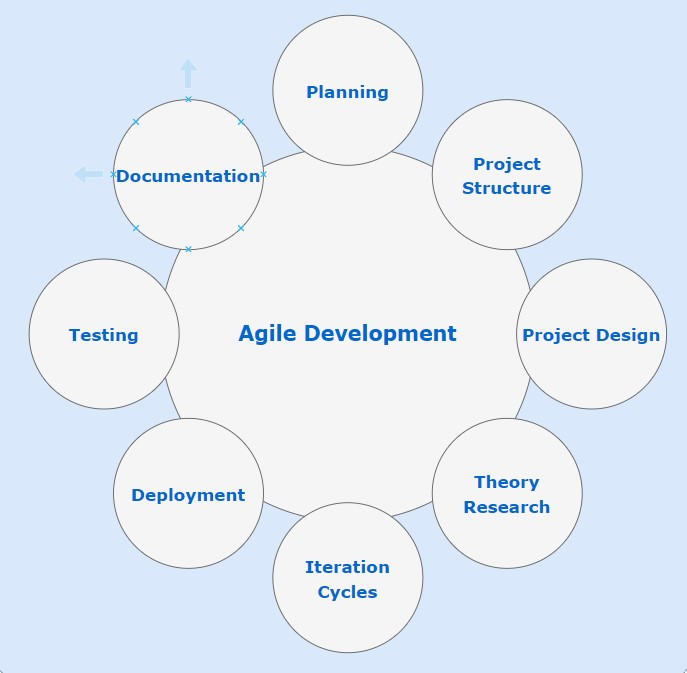

---

### [Milestones](https://github.com/bono-94/Full-Stack-Portfolio/milestones) 

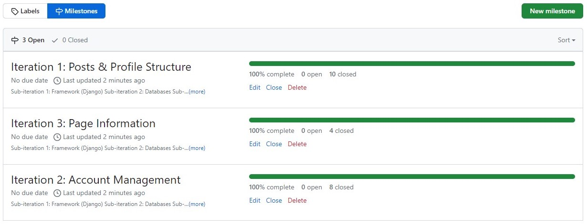

---

### [Issues](https://github.com/bono-94/Full-Stack-Portfolio/issues?q=is%3Aissue+is%3Aclosed) 

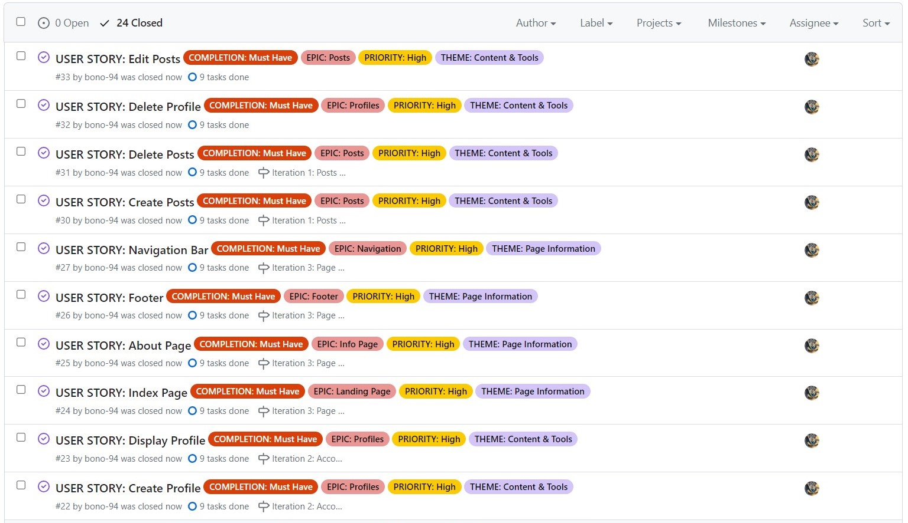

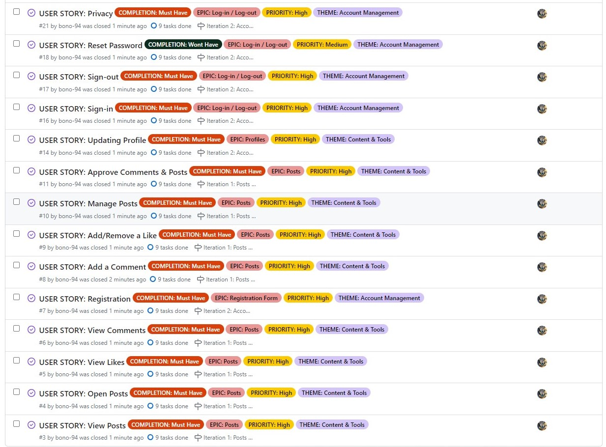

---

### [Project Board](https://github.com/users/bono-94/projects/2) 

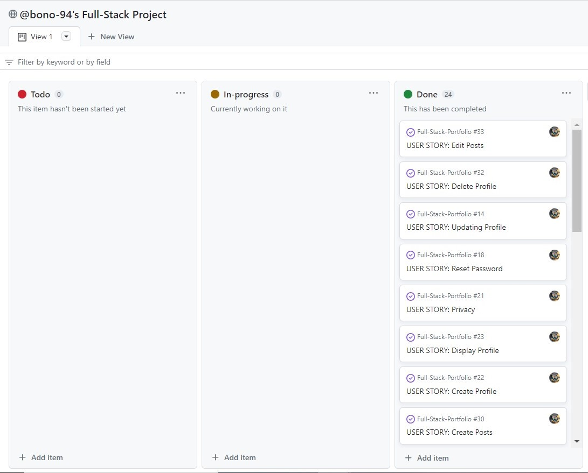

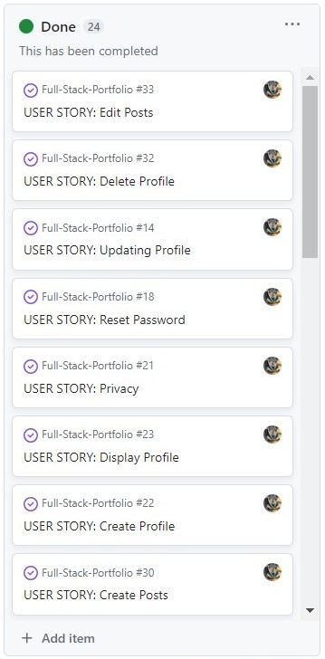

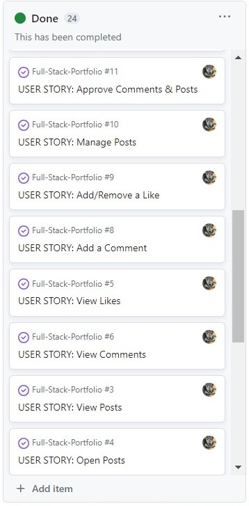

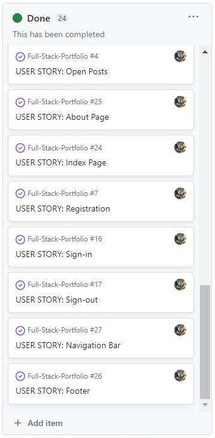

## Design

- Problem Solving:
  - How to solve users problem of not getting enough exposure for their organizations, projects, products and services?
  - How to solve users problem of lack of business knowledge to capture and deliver their ideas to the public marketplace?
---

- Empathy and Understanding:
  - Direct connection to the user and their actual real life circumstances
  - Developing a database of potential user personas and if current product would make them happy
---

- Definition:
  - Final problem statement, user as center point
  - What is the root or the problem and what is the cure?
  - What needs to be achieved, not how
---

- Ideation:
  - Generating key ideas based on well-defined problem
  - Creative solutions to the problem and how it can be achieved
  - Voting and decision and most suitable solution
---

- Prototyping:
  - Developed rough draft of the solution
  - Sketches
  - Wireframes
  - Flowchart
  - Data Architecture
---

- Testing:
  - Test if final solutions have solved all the problems
  - Testing on real user and real life environment
  - Development of hypothesis and final vision
---

- Storytelling:
  - Presenting the findings
  - Presenting the conclusions
  - Presenting the process
  - Presenting the solution
  - Story of users who's challenge was solved
  - Story of Design Thinker, and his next steps
---

- User Expectations:
  - Fast service
  - Fast delivery
  - Free/cheap access
  - Contact availability
  - Global accessibility
  - High quality in high quantity
  - Variety of options
  - Flexibility to all user types 
---

- Quantum Coloration:
  - Main colors - orange and black which compliment and contrast each other well (structural coloring purpose)
  - Secondary colors - light blue and white are used as separation between content and main colors (organizational coloring purpose)
  - Tertiary colors - grey which comes out as combination of black and white naturally serves as background and space filler in most of the cases(color-matching purpose)
  - The separation between main and secondary color does a significant purpose to the project visually separating content type for user due to a lot of options and visualisations. They can stand separate or next to each other, 4+1 color model has turned out exactly as envisioned, if not even better. Every element has been colored with purpose and in consideration of all other elements

  

---
- Fonts:
  - Open Sans - used as a balanced, harmonious style for all larger elements of the page
  - Roboto - used as modern, simple and readable style for all paragraph and text elements 
---

- Numerology:
  - Everywhere where possible, number 21 has been encoded, meaning all other additions of it too, 42, 63, 84, etc...
---

- Layout - besides coloring separation, main website structure can be separated on pages below:
  - Index
  - About
  - Register
  - Login
  - Logout
  - Post List Public
  - Post List Private
  - Post Details Page 1
  - Post Details Page 2
  - Post Details Page 3
  - Post Details Page 4
  - Post Details Page 5
  - Post Details Page 6
  - Post Create
  - Post Edit
  - Post Delete
  - Public Profile View
  - Private Profile View
  - Profile Edit
  - Profile Delete
---
 
- Media
  - Custom Media - Professional custom work for the most important visual aspect of navigation logo, tab logo and index landing page  
  - Imported Media - Stock images for about page image, profile and post placeholders
---

- Design Strategy
  - Focus of this version was deep design and architecture of the back-end
  - There is where the most design has been implemented to ensure strong foundation for the next step
  - In the second version, upon learning React and Rest, focus of design will shift towards the front-end
  - Please note due to hundreds of input fields in Post and Profile models, detailed visualization is not available at the moment
---

- Data Design

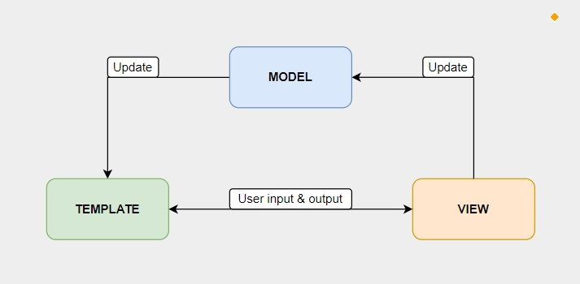

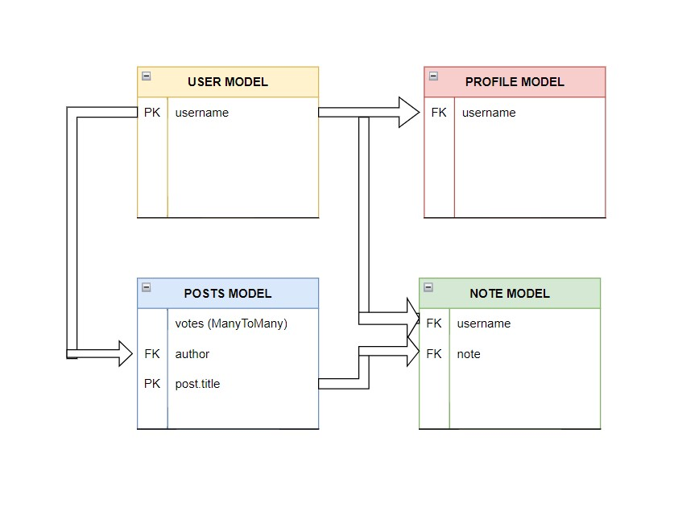

---

#### User Stories Validation with Design

- USER STORY 1: "As an innovator, I want to be able to document business-orientened segments for my ideas that I can share with public."
    - In the final design of version one user is indeed able to use many options as buildings blocks to build their own small webpage within Innovation Land page
    - This tool is used to offer variety of most-commonly and most important used business questions, documentation and information 
    - User can user privacy sliders to turn off any blocks from showing allowing full self-service online business environment
  ---
- USER STORY 2: "As a project owner or entrepreneur, I want to share my organization, projects, products and services with the global community through direct engangement with visitors and community."
  - In the final design of version one, user can choose what category of a post they would like to post publicly
  - Each post page is structured in a way that for all 4 types user mentioned (organization, projects, products, services) no matter selection it does not impact the rest of the page meaning all blocks are fully flexible and independent of each other
  - User can interact with other users throught comments section on every of 6 post pages at the bottom
  - User also has an option to leave public contact information before comments for further direct and discreet communication
  ---
- USER STORY 3: "As an investor, I want to be able to browse catalog of posts and read everything about each post's business proposals"
  - In the final design of version one, user if registered can view list of all posts created by all users
  - On the page 6 of post details sub-page, user can see any type of proposal that post author or post owner are open to
  - There are basic details for any investor to see how much would it cost them and what do they get in a return
  ---
- USER STORY 4: "As an end-user, I want to know more about the products and services that I am consuming and who provides them to me."
  - In the final design of version one, every registered user can acess posts and see all shared details from authors and owners
  - It contains detailed information about online placement itself, about creators of placement, story of placement and documentation
  - User can also see public proposals the post is offering if they want to futher engage with the creators
  - User has possibility to contact creators directly if that information is publicly shared
  ---
- USER STORY 5: "As a publishing author, I want to write various high-quality posts as a service for organizations, innovators and project owners while being to share as many as possible information about myself for attracting further opportunities."
  - User as a service-provider has large selection of customization tools and different fields to enter their clients content in a professional manner
  - User can create also their profiles with again large selection of options to create their custom profiles to stand out
  - Focus is on business side and as an extension to common Resume (CV) and Cover Letter
  - User has various visuals tools available for use such as privacy sliders, profile photo, profile quote, profile color, profile video, profile background audio, documentation upload, social media buttons, etc...
  - User can leave public contact information in order to capture every potential business interest

## Development

- Create Project 
- Plan Project 
- Start Project 
- Project Settings 
- Create Database 
 - Postgre SQL 
 - Cloudinary
 - Excel 
 - PowerBI 
 - Word
- Create Models 
- Create Views 
- Create Urls 
- Create Forms 
- Create Admin 
- Custom Python Logic 
- Create Templates Structure
- Add Bootstrap 
- Add CSS Custom Styling 
- Add Javascript Interactivity
- Final Test
- Project Results
- Bookmarks & Notes
- Assignment Description
- Deployment
- Full Manual Testing
- Documentation

## Deployment

This project was deployed using Heroku website and ElephantSQL + Cloudinary as a database

### [Live Link](https://innovation-land.herokuapp.com/)

### Deployment steps:
- Create or login to Heroku account
- Activate Student GitHub Pack
- Update billing information
- Create new app/website
  - add name and region
- Access settings
- Create Config Var
  - input “CREDS” into the “KEY” field
  - add “PORT” to “KEY” and “8000” to “VALUE”
- Go to deployment section
  - select github and connect to the relevant account
  - search for relevant repository and connect
  - choose manual deployment option
  - everything gets installed
  - link is provided when finished
- Subscribe to ecodynos plan under the billing options
- Create Coudinary account and wire to django settings
- Create Elephant SQL free account and connect to django environment and Heroku configurations
- Create additional instance on Elephant SQL to separate development from production environment
- Update requierements.txt
- Check if any outstanding migrations
- Turn Debug off
- Add DISABLE_COLLECTSTATIC = 1 in Heroku configuration
- Push changes
- Remove DISABLE_COLLECTSTATIC = 1
- Push changes
- Quick Redeployment
- Quick Testing
- Applying changes where necessary
- Pushing final changes
- Redeployment
- Full manual test
- Populate with content
- Checking if all static files and user uploads are correctly stored in Cloudinary & Elephant SQL

## Testing 

I have conducted infinite hours of testing across all screen sizes, devices and different browsers to conclude that now the site works well and all discussed features are included as intended. Internet Explorer, Google Chrome, Safari, and Firefox on large PC monitors, average laptops, tablets, and various mobile devices all in different screen sizes with minimum width of 320px for older devices. The website was given to friends and family to test out the website representing different types of users and their browsing styles next to personal backgrounds. All content is readable and understandable styled with good contrasting colors that also visually create a good combination. There is no visual bugs or errors after extensive testing

- Automatic testing has been left until version 2.0 when it will be of use for specific new features that will benefit of it
- For current project structure and endless hours of manual testing it does not make significant contribution since everything has been already validated

### Validator Testing 

- HTML
  - No errors when passing through the official [W3C validator](https://validator.w3.org)
  - All of these files were individually tested, the only warnings it raised is using {{}} and  to render back-end values which is not impacting live version in any way
  - 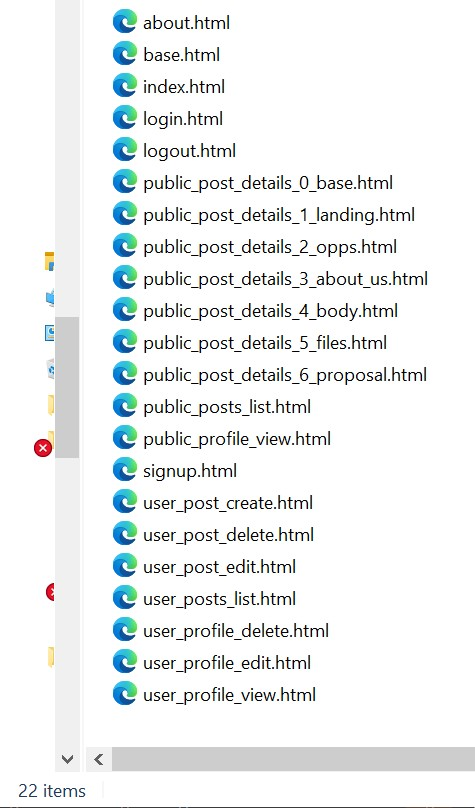

---

- CSS
  - No errors when passing through the official [Jigsaw validator](https://jigsaw.w3.org/css-validator)
  - 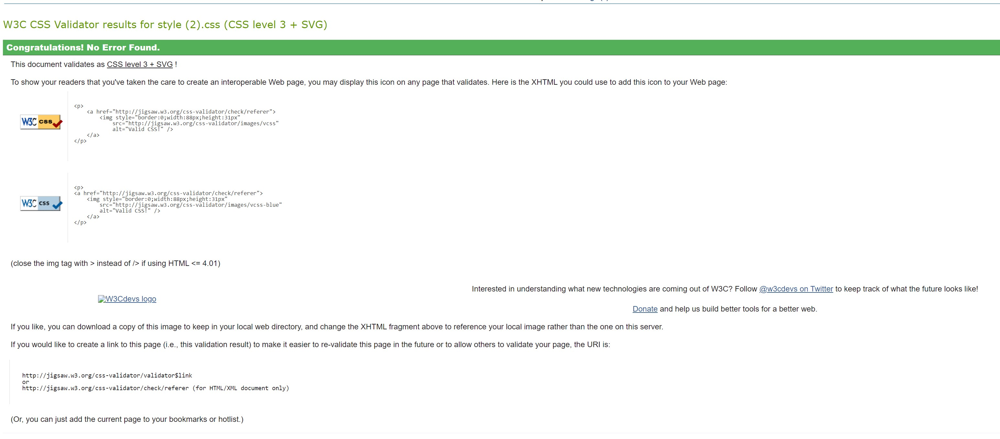

---

- Jshint
  -  No errors when passing through the official [Jshint validator](https://jshint.com)
  - Metrics returned:
    - There are 59 functions in this file
    - Function with the largest signature take 1 arguments, while the median is 0
    - Largest function has 32 statements in it, while the median is 8
    - The most complex function has a cyclomatic complexity value of 21 while the median is 2
  - 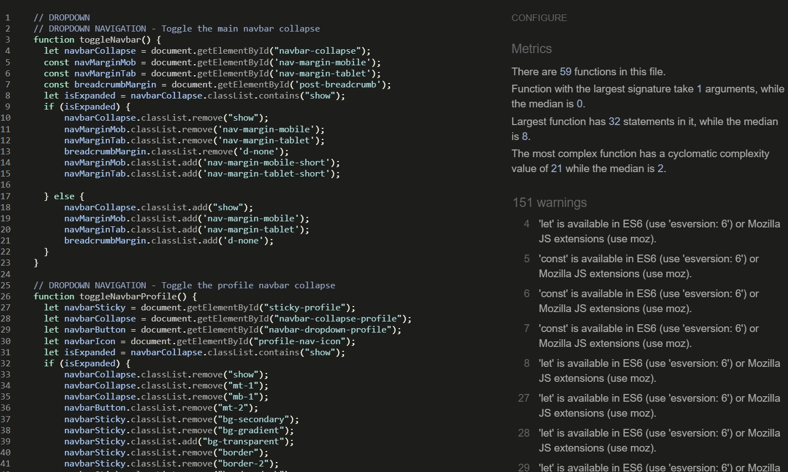

---

- PEP8
  - No errors found when validating all 7 python files and all of their lines of code individually at:
  - [Code Institute CI Python Linter](https://pep8ci.herokuapp.com)

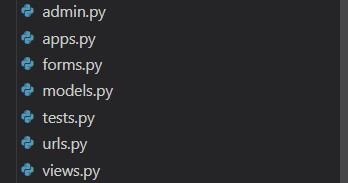

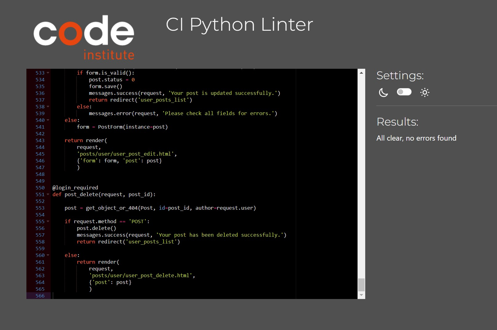

----

### Stats

- approximate total lines of code: 14,000
- approximate total templates: 21
- approximate 14,000 words in the project tasklist (Microsoft Word)
- approximate 90 pages of project tasklist (Microsoft Word)

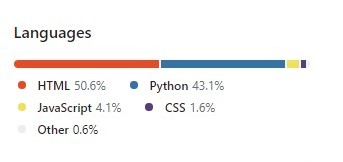

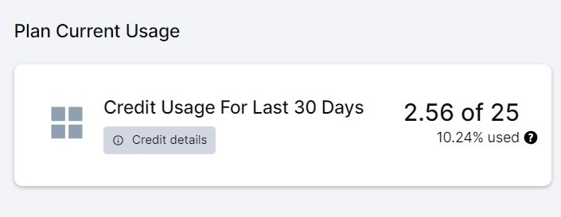


### Manual Testing

This project was manually tested with following procedures:

- Code was passed through a PEP8 linter inside gitpod without any errors returned
- Entire website, every input field, every element and button were tested with correct and incorrect inputs in the both gitpod pre-deployment and Heroku post-deployment environments

##### CONCLUSION: Production version matched development version without any errors

---

#### Test 1 - Responsivness

- Expected:
  - All 22 template pages to be rendering all building blocks beautifully and without errors across all devices and screen sizes
- Testing:
  - Tested every template page visually in 8 rounds
    - Round 1: Mobile devices 320px width gradually increasing to 768px width
    - Round 2: Tablet devices 768px width gradually increasing to 1024px width
    - Round 3: Laptop devices 1024px width gradually increasing to 1920px width
    - Round 4: PC monitor devices 1920px width gradually increasing to 3840px width
    - Rounds 5-8: Repetition of rounds 1-4 for double verification
  - Tested on 4+ phones, 2 tablets, 4+ laptops and 2 large PC monitors
  - Tested by developer and friends and family as secondary opinion
- Result:
  - Every element, every section, every building block of the website has been styled and rendered correctly in all responsivness testing scenarios in deployed version

---

#### Test 2 - Navigation

- Expected:
  - Navigation bar logo takes user to home page
  - Home button takes user to home page
  - About button takes user to about page
  - Public Posts button takes user to public posts list page
  - My Posts button takes user to private posts lists page
  - Create Post button takes user to the create post page
  - My profile button takes user to its' private profile page
  - Logout button takes user to logout page
  - Login button takes user to login page
  - Register button takes user to registration page
  - Posts button is a dropdown for Public Posts, My Posts and Create Post
  - All buttons while on their active pages replace background orange with background black color and text color from black to orange
  - Toggle button appears on screens under tablet size
  - Toggle button shows navigational buttons as under each other
  - All colorization of navigation bar renders correctly
- Testing: 
  - Tested all buttons by clicking on them and around them
  - Tested all buttons navigation by validating destination url with url file
  - Tested dropdown on all devices if it would show categories of Posts button
  - Tested all active buttons by manually inputting url link from urls file and seeing visually if the active button changes apply
  - Tested if toggle button appears with inspector mode in Google Chrome
  - Tested if toggle button activates navigation buttons structure on click
  - Tested if navigation bar colors appear correctly while comparing to source code
- Result:
  - All tests have been successfully passed in multiple testing rounds of deployed version

---

#### Test 3 - Footer

- Expected:
  - Footer renders correctly in structure
  - Footer renders correclty in colorization
  - Footer provides valid links to social media pages in new tab
- Testing:
  - Tested footer rendering correctly on all devices and screen sizes specifically
  - Tested visually if footer satisfies criteria of black background, orange text and white icons
  - Tested all 4 social media links for correct destinations in a new tab
- Result:
  - All tests have been successfully passed in multiple testing rounds of deployed version

---

#### Test 4 - Index

- Expected:
  - Landing image renders correctly
  - Introduction section button leads user to about page
  - Posts square takes user to public posts
  - Profiles square takes user to its' profile
  - Business ecosystem cards proper division per screen width
- Testing:
  - Tested landing image by draging width in google chrome inspector for all sizes and screens
  - Tested by clicking on Read more button and validating url destination
  - Tested by clicking on Explore opportunities button and validating url destination
  - Tested by clicking on Prepare yourself button and validating url destination
  - Tested by seeing arrangement of ecosystem cards across phone, tablet, laptop and PC monitor
- Result:
  - All tests have been successfully passed in multiple testing rounds of deployed version

---

#### Test 5 - About

- Expected:
  - Landing image renders correctly with quotation under
  - All About Us cards show correctly with icon, large title and thin light blue border with 3d shadow effect
  - All 3d separators show correctly and with intended style
  - Pricing and membership model shows description and types of memberships
  - If user is not signed in, they can see additional buttons on each membership block to sign up to get more information
- Testing:
  - Tested landing image by draging width in google chrome inspector for all sizes and screens
  - Tested all About Us cards across various devices and screens to see if they keep their structure
  - Tested all 3d separators individually across various devices and screens
  - Tested in pricing and membership model shows all belonging information
  - Tested by logging out and logging in if only non-authenticated user can see signup buttons on membership blocks
- Result:
  - All tests have been successfully passed in multiple testing rounds of deployed version

---

#### Test 6 - Logout

- Expected:
  - Addition of extra top and bottom margin on logout 3d box for all large PC monitors
  - Shadow creating floating block
  - Close button takes user to previous page
  - Submit button logs user out of their account and convert to non-authenticated user
- Testing:
  - Tested creation of extra margin for logout block with actual PC monitor to see if footer would still remain fully to the bottom
  - Tested in google inspector and visually if shadow renders correctly
  - Tested close button by clicking on it and around it while verifiying url destination path with url file
  - Tested close button by clicking on it and around it while verifiying url destination path with url file, also by checking if visibility of navigation matched non-authenticated user
- Result:
  - All tests have been successfully passed in multiple testing rounds of deployed version

---

#### Test 7 - Login

- Expected:
  - Addition of extra top and bottom margin on login 3d box for all large PC monitors
  - Shadow creating floating block
  - Remember Me button keep user loged in on the same device
  - Login button allows user to enter full-features environment of the website and interact with own post and profile contents
  - Register button link takes user to registration page
- Testing:
  - Tested creation of extra margin for login block with actual PC monitor to see if footer would still remain fully to the bottom
  - Tested in google inspector and visually if shadow renders correctly
  - Tested if remember me button works by turning off my device for few hours and trying to open it again without logging out
  - Tested login button by clicking on it and around it while validating destination matches url path and if navigation bar options match authenticated user
  - Tested if registration link works by clicking on it and around it while validating if destination matches url path in url file
- Result:
  - All tests have been successfully passed in multiple testing rounds of deployed version

---

#### Test 8 - Register

- Expected:
  - Addition of extra top and bottom margin on login 3d box for all large PC monitors
  - Shadow creating floating block
  - Email address field does not accept inputs that are not an email format
  - Username field does not support already existing values
  - Password fields validate each other if confirmed password matches selected one
  - Register button creates a profile and user account for a user while automatically logging user in
- Testing:
  - Tested creation of extra margin for login block with actual PC monitor to see if footer would still remain fully to the bottom
  - Tested in google inspector and visually if shadow renders correctly
  - Tested if email address field validates correctly by entering only username without @ symbol
  - Tested if username field works with uniqueness by providing already existing username
  - Tested if password fields confirmation works by first entering non-matching, then matching password
  - Tested register button if it logs user in upon form completion and if proper user account and profile has been generated in the back-end admin page
- Result:
  - All tests have been successfully passed in multiple testing rounds of deployed version

---

#### Test 9 - Posts Lists

- Expected:
  - Private and public views have their own versions of introduction content and navigation buttons from public to go to private and from public to private
  - Pagination of 8 posts per page works correctly
  - Post list images uploaded by user render correctly
  - Post list images show placeholder if not uploaded by user
  - Every post card also shows verification icon in the top right corner
  - Only on private view, user can see fixed privacy icon in top left corner
  - Only on private view, user can see post status label in the bottom left corner of the card image
  - All key information and counters render correctly on the card
  - All custom colorization of card renders correctly
  - On public view, only author can view, edit and delete while non-authors can only view post
  - On private view, only published posts can be edited, viewed and deleted, while unpublished posts can be only deleted
- Testing:
  - Tested differences in introduction and its buttons on both private and public pages by rendering them both as multiple users
  - Tested if pagination of page with 8 posts per each works by creating minimum 17 posts to get to the third page
  - Tested post list images with edit and create post forms by uploading an image file
  - Tested post list placeholder by excluding image from edit and create post forms
  - Tested post verification button by manually adjusting post verification as admin in admin portal
  - Tested privacy icons by checking private posts and changing public visibility slider on edit form page
  - Tested post status label by checking private posts page after changing post status back and forth in the admin portal
  - Tested post card important information by filling it up in edit and create post forms and checking both public and private views
  - Tested post card colorization by manually editing post primary and secondary colors while swithching post list colorization slider to the right
  - Tested image overlay buttons by first cheking public, then private views both as author and non-author
- Result:
  - All tests have been successfully passed in multiple testing rounds of deployed version

---

#### Test 10 - Posts Details (Constant)

- Expected:
  - Breadcrumb stays constant under navigation featuring music button, offcanvas called button and close post button
  - Post card is fluid with constant black background
  - Post card shows author image or organization logo
  - Post card renders title, description, author and owner
  - Post card counts number of votes, views and comments next to verification status icon
  - Post cards allows user to add or remove vote on each post
  - Post card shows creation and last updated dates while counting the age
  - Offcanvas shows current page
  - Author link takes user to their public profile
  - Owner link takes user to contact section below
  - If user is author, show edit and delete buttons fixed to the bottom right taking them to correct pages
  - If user is not author, show only money bag icon taking user to proposal and offers page
  - Every post details page has page navigator from 1-6 and buttons such as last to view previous page and next to view next page, indicating active page and offering Read more button to open offcanvas for user
  - Every post details page has below page navigation post contact section
  - Every post contact section allows authors to render the correct contact person, phone number, email, contact availability and social media links
  - Every post details page has commenting section under contact section that renders all comments on the entire post while allowing users to place their own comments
  - Every page should be custom colored if user indicates
- Testing:
  - Testing breadcrumb especially on all screens and devices since it is most sensitive block of the website on top margins
  - Testing if breadcrumb play and stop buttons play and pause uploaded audio file
  - Testing if breadcrumb expansion button correctly calls upon offcanvas
  - Testing if breadcrumb close button closes the post and brings user back to post list page
  - Testing if breadcrumb page path matches url file rules and offcanvas active page
  - Testing if post card is fluid and takes entire width of screen on all devices and screens
  - Testing if uploaded post logo image renders on the card as author image or organization logo in constant round circle structure
  - Testing if post card renders title, description, author and owner by inputting this information on edit and/or create post forms
  - Testing if post card counts number of votes by manual interaction as user next to admin back-page custom input
  - Testing if post cards counts views by manually opening and closing posts many times
  - Testing if post cards counts number of comments by adding comments and manually counting them on the page and back-end
  - Testing if post cards correctly display verification status by manually changing it in the admin back-page and refreshing the page
  - Testing voting animations and colorization by manual vote add and manual vote remove icon on the page
  - Testing if post card creation and last updated dates are correct by creting new posts and editing already created posts. Waiting time minimum 24 hours so duration tracker can be validated too
  - Testing if offcanvans shows current page by matching it with url file rules, breadcrumb and page navigational tool at the bottom
  - Testing if author link takes user to their public account by pressing on link and around it and verifying it in the url path
  - Testing if owner link takes user to contact section by clicking on it and around it and verifying it visually and with url path
  - Testing if user is author to show edit and delete icons as logging out and loggin in with author credenditals
  - Testing is user is not author to show money bag icon by opening public posts with different author
  - Testing all buttons on navigational tool for all 6 pages by clicking on all of them and seeing if destination matches breadcrumb, offcanvas and url path about
  - Testing if every page has contact section under each navigational tool is visually and by opening every of 6 pages
  - Testing if contact page is rendering information correctly by manually inputing information in edit and create forms
  - Testing if contact page social media links open in a new tab by clickling directly on them and around them and verifiying end url path in new tab
  - Testing if commenting section renders comments by manually adding them in admin back-end but also as a user on the leave a comment form
  - Testing if post details colorization works for every post by selecting post detail custom colorization options and trying different colors
- Result:
  - All tests have been successfully passed in multiple testing rounds of deployed version

---

#### Test 11 - Posts Details (Page 1)

- Expected:
  - Post image should render in full width if uploaded, if not show post placeholder image
  - Title renders
  - Introduction content renders
  - General information card renders
  - Post video renders 
  - Launch date renders
  - Launch countdown renders
- Testing:
  - Testing if post image renders by uploading it as user in edit and create post form
  - Testing if post image placeholder image renders by removing post image and refreshing the page
  - Testing if welcome title renders in correct color by visual testing
  - Testing if introduction content renders correctly by checking it on various screens and devices and validating if matches submitted input
  - Testing if general information card renders by inputting values in edit and create post form and verifying if it matches rendered version
  - Testing if post video renders by uploading video file within limits in post edit and post create forms
  - Testing if launch date renders by inputting date value in post edit and post create forms
  - Testing if launch date countdown renders by inputting date value in post edit and post create forms and allowing calculation to capture days, months and years
- Result:
  - All tests have been successfully passed in multiple testing rounds of deployed version

---

#### Test 12 - Posts Details (Page 2)

- Expected:
  - Title renders
  - Strategy renders
  - Co-operation renders
  - Key elements render
  - Dynamics render
- Testing:
  - Testing if about post title renders in correct color by visual testing
  - Testing if all building blocks render by checking privacy field, input fields and adding all correct values in edit and create post form, then verifying if it matches rendered version
- Result:
  - All tests have been successfully passed in multiple testing rounds of deployed version

---

#### Test 13 - Posts Details (Page 3)

- Expected:
  - Title renders
  - Who are we? renders
  - What are we doing? renders
  - SWOT renders
  - Business focus renders
  - Business departments renders
- Testing:
  - Testing if about post creators title renders in correct color by visual testing
  - Testing if all textual building blocks render by checking privacy field, input fields and adding all correct values in edit and create post form, then verifying if it matches rendered version
  - Testing if business focus values are always in pairs total sum of 100
  - Testing if business focus chart values match inputted values
  - Testing if business departments content renders correctly and matches colorization
  - Testing if business departments percentage is under 100 on each input field
- Result:
  - All tests have been successfully passed in multiple testing rounds of deployed version

---

#### Test 14 - Posts Details (Page 4)

- Expected:
  - Title renders
  - Knowledge renders
  - Journey renders
  - Future renders
  - Legacy renders
- Testing:
  - Testing if about post story title renders in correct color by visual testing
  - Testing if all textual building blocks render by checking privacy field, input fields and adding all correct values in edit and create post form, then verifying if it matches rendered version
- Result:
  - All tests have been successfully passed in multiple testing rounds of deployed version

---

#### Test 15 - Posts Details (Page 5)

- Expected:
  - Title renders
  - Library renders
  - Cabinet renders
  - Downloadeable content on each custom icon
- Testing:
  - Testing if about post documentation title renders and subtitles in correct color by visual verification
  - Testing if all textual building blocks render by checking privacy field, input fields and adding all correct values in edit and create post form, then verifying if it matches rendered version
  - Testing if all custom icons show up for each row containing a document
  - Testing if clickling on an icon would automatically download documentation locally
- Result:
  - All tests have been successfully passed in multiple testing rounds of deployed version

---

#### Test 16 - Posts Details (Page 6)

- Expected:
  - Title renders
  - Stocks proposal renders
  - Ownership percentage renders
  - Product or service renders
  - Lifetime discount renders
  - Guaranteed team position renders
  - Partnerships renders
  - Collaborations renders
  - Sponsorships renders
  - Open proposal renders
  - T&C renders
  - Funding campaign section has start date, end date and countdown
  - Funding payout section has start date and a countdown
- Testing:
  - Testing if about post proposals & offers title renders in correct color by visual verification
  - Testing if all textual building blocks render by checking privacy field, input fields and adding all correct values in edit and create post form, then verifying if it matches rendered version
  - Testing if stock supply matches or is greater than stock proposal
  - Testing if product or service supply matches or is greater than stock proposal
  - Testing if campaign start date and end date render by selecting dates in edit and create post form
  - Testing if campaign start date generates correct countdown values
  - Testing if funding payout date renders by selecting date in edit and create post form
  - Testing if campaign payout date generates correct countdown values
- Result:
  - All tests have been successfully passed in multiple testing rounds of deployed version

---

#### Test 17 - Posts Delete

- Expected:
  - Addition of extra top and bottom margin on post delete 3d box for all large PC monitors
  - Shadow creating floating block
  - Back button takes user to previous page
  - Delete button calls up on verification modal before deleting post and all of its associated content and comments and takes user to their own posts
- Testing:
  - Tested creation of extra margin for post delete block with actual PC monitor to see if footer would still remain fully to the bottom
  - Tested in google inspector and visually if shadow renders correctly
  - Tested back button by clicking on it and around it while verifiying url destination path with url file
  - Tested delete button by clicking on it and around it while verifiying url destination path with url file, also by checking if post has been deleted from post list and admin page, including all of its' relevant content and comments
- Result:
  - All tests have been successfully passed in multiple testing rounds of deployed version

---

#### Test 18 - Posts Edit

- Expected:
  - User can see name of post being edited
  - User can see categorization list of all building blocks of posts
  - User can expand any list title which changes color to orange and shows all relevant fields
  - Text input fields should allow long multi-line text
  - Char input fields should allow short one-line text
  - File uploads should show currently uploaded file name, clear button and/or button to choose a new file
  - Slider inputs should indicate Boolean values
  - Color input fields should allow user to interract with color pickers
  - Selector input should allow user to chose one out of list of possible values
  - Date input fields should allow user to chose date featuring month, year and date
  - Integer fields should allow user to only input numbers
  - Float fields should allow user to only input numbers with decimals
- Testing:
  - Testing if user can see name of post being edited by visually verifiying
  - Testing if user can see post categorization list of major building blocks by visually verifying
  - Testing if user can expand all of the titles by clicking on all of them, noticing color change only for opened and showing all belonging input fields from models and forms files
  - Testing if text input fields render correctly by visual verification
  - Testing if char input fields render correctly by visual verification
  - Testing if file input fields render correctly by visual verification and interaction
  - Testing if slider input fields render correctly by visual verification and interaction
  - Testing if color input fields render correctly by visual verification and interaction
  - Testing if selector input fields render correctly by visual verification and interaction
  - Testing if date input fields render correctly by visual verification and interaction
  - Testing if integer input fields render correctly by visual verification and interaction
  - Testing if float input fields render correctly by visual verification and interaction
- Result:
  - All tests have been successfully passed in multiple testing rounds of deployed version

---

#### Test 19 - Profile Delete

- Expected:
  - Addition of extra top and bottom margin on profile delete 3d box for all large PC monitors
  - Shadow creating floating block
  - Back button takes user to previous page
  - Delete button calls up on verification modal before deleting profile and all of its associated content such as posts and comments and takes user back as non-authenticated to home page
- Testing:
  - Tested creation of extra margin for profile delete block with actual PC monitor to see if footer would still remain fully to the bottom
  - Tested in google inspector and visually if shadow renders correctly
  - Tested back button by clicking on it and around it while verifiying url destination path with url file
  - Tested delete button by clicking on it and around it while verifiying url destination path with url file, also by checking if profile has been deleted from admin page, including all of its' relevant content and comments
- Result:
  - All tests have been successfully passed in multiple testing rounds of deployed version

---

#### Test 20 - Profile Edit

- Expected:
  - User can see username of profile being edited
  - User can see categorization list of all building blocks of profiles
  - User can expand any list title which changes color to orange and shows all relevant fields
  - Text input fields should allow long multi-line text
  - Char input fields should allow short one-line text
  - File uploads should show currently uploaded file name, clear button and/or button to choose a new file
  - Slider inputs should indicate Boolean values
  - Color input fields should allow user to interract with color pickers
  - Selector input should allow user to chose one out of list of possible values
  - Date input fields should allow user to chose date featuring month, year and date
  - Integer fields should allow user to only input numbers
  - Float fields should allow user to only input numbers with decimals
- Testing:
  - Testing if user can see username of profile being edited by visually verifiying
  - Testing if user can see profile categorization list of major building blocks by visually verifying
  - Testing if user can expand all of the titles by clicking on all of them, noticing color change only for opened and showing all belonging input fields from models and forms files
  - Testing if text input fields render correctly by visual verification
  - Testing if char input fields render correctly by visual verification
  - Testing if file input fields render correctly by visual verification and interaction
  - Testing if slider input fields render correctly by visual verification and interaction
  - Testing if color input fields render correctly by visual verification and interaction
  - Testing if selector input fields render correctly by visual verification and interaction
  - Testing if date input fields render correctly by visual verification and interaction
  - Testing if integer input fields render correctly by visual verification and interaction
  - Testing if float input fields render correctly by visual verification and interaction
- Result:
  - All tests have been successfully passed in multiple testing rounds of deployed version

---

#### Test 21 - Profiles (Public + private)

- Expected:
  - Public profile and private profile should render identical besides url and in private version, user has 3 additional buttons to create new account, edit existing profile or delete current profile
  - Both views have title indicating if it is public or prive profile
  - Both views have profile image if user uploaded one, if not there is a placeholder
  - Both views should have quotation and music buttons appear below profile image
  - Both views should allow user to upload profile cover video
  - Both views have profile card with general structural information
  - Both views have expandeable titles of profile sections that when clicked they show card with content underneath them, and on second click it hides the card and reduces spacing
  - Both profiles have navigational offcanvas that appears by clicking button in the lower left corner of the screen from which user can navigate all sections
  - Both views have reverse expansion button in lower right corner of the screen that closes all open profile categories that are open and open ones that are closed 
- Testing:
  - Testing if public and profile views have identical structure besides 3 buttons and different url paths
  - Testing if title of the profile matches url and view
  - Testing if profile image renders once uploaded in edit form
  - Testing if profile image placeholder renders after removing image from edit form
  - Testing if quotation and music control button appears under profile image / profile placeholder on all screens and devices
  - Testing if user is able to upload the cover video in edit form and rendering it back on their both private and public profile views
  - Testing if all profile categorization title are appearing from code repository
  - Testing if all profile titles are expandeable on click that show belonging content in a form of card
  - Testing if second click on titles always collapses relevant content
  - Testing if navigational offcanvas takes user to correct profile category title
  - Testing if reverse collapse button closes all open profile categories and opens the closed ones
- Result:
  - All tests have been successfully passed in multiple testing rounds of deployed version

---

### Bugs

__Unsolved Bugs__

- All bugs were solved
- There were no significant bugs in the development process
- Mostly it was learning curve of new framework so every step of the code there was an error that was solved with learning, persistance and effort
- Sources of knowledge are included below.
- Once fully understood, everything made sense and it was easy to create entire website without distractions and bugs
- What could be qualified as bug are console errors that have no impact on the code and scripts that too complex to solve at the moment


## Credits 

### Content, Knowledge and Code
  
- All content and code are 100% unique and custom-made per request for a client in order to prevent any legal issues in the future and to provide full control over an optimized experience

- All content, concepts, and visuals have been exclusively created for this site and to solve specific problem for any user without any external inspiration

- Code structure is also 100% original and completely created by a developer. A developer has followed HTML, CSS, JavaScript and Python courses at [Code Institute](https://codeinstitute.net/global/) where theory on building blocks has been taught. After reading through knowledge materials to see what are possibilities of creating this site are, general blocks have been put together separately to create original work. Given completed examples have not been plagiarized but served as a general guide. Finally, the README structure has been used by Code Institute's template and example in this project in order to be created under industry standards and expectations. A general django template for repository created for students before commencing their project for convenience has been imported before the first coding lines. Project requirements have been used as secondary rough guidelines for the content structure. Consultations with Student Care, Tutors, and Personal Mentor Rowan were provided by them as well which was crucial in this project creation by providing support, motivation, and any mistakes indications and guidance to own problem-solving. Code Institute, therefore can be referenced also as the main knowledge source tool

- All debugging and problem-solving has been done strictly by the developer trying different combinations with known and unknown elements and attributes. No external sources and no professional help just Code Institute's tutors for elaboration on theory and advices dealing with complex problems
 
### Websites & Tools

- [GitHub](https://github.com/) has been used to create project repository, store all the files and create issues, tasks and project board

- [GitPod](https://gitpod.io/) has been used to edit all the project code and files

- [Elephant SQL](https://www.elephantsql.com/ ) has been used for storage and retrieval of all text and numbers data of user inputs

- [Cloudinary](https://cloudinary.com/ ) has been used for storing all users input media and documents, but also local static media used for entire website 

- [Google Chrome](https://www.google.com/chrome/) has been used to capture references as bookmarks, edit code and inspect the pages

- [Draw.io](https://app.diagrams.net/) has been used to visualize database design

- [ChatGPT](https://openai.com/) has been used to write imaginary posts content after deployment for time management to save hours of coming up with the content for posts and profile instead using Lorem ipsum text

- [Grammarly](https://app.grammarly.com/) software has been used to verify grammar on the site and this README file

- [Google Fonts](https://fonts.google.com/) website has been used to import 2 font families: Open Sans & Roboto

- [Coolors](https://coolors.co/fcfcfc-060b0f-ff8600-00a7e1-92a6b5 ) website has been used to create 4+1 color design schema for main colors of the website

- [Font Awesome](https://fontawesome.com/start) website has been used to add all icons on the website

- [Character Counter](https://www.charactercountonline.com/ ) website has been used to count characters for testing the content and fixing python maximum line length

### Libraries

- [Django](https://www.djangoproject.com/) library has been used as a Python framework of the project

- [Summernote](https://summernote.org/getting-started/) library has been used for admin page customization of specific text content

- [Djecrety](https://djecrety.ir/) library has been used to generate random Django secret key 

- [All-auth](https://django-allauth.readthedocs.io/en/latest/) library has been used to create basic registration, login and logout in Django framework

### Templates

- [Code Institute](https://github.com/Code-Institute-Solutions/django-blog-starter-files) template has been used for creating GitHub repository of the project

- [Bootstrap 1](https://getbootstrap.com/docs/5.0/examples/features/) template has been modified and customized for index page list of features

- [Bootstrap 2](https://getbootstrap.com/docs/5.0/examples/jumbotron/) template has been modified and customized for index page jumbotron

- [Bootstrap 3](https://getbootstrap.com/docs/5.0/examples/pricing/) template has been modified and customized for about page memberships 

- [Bootstrap 4](https://getbootstrap.com/docs/5.0/examples/album/) template has been Template modified and customized for structure of post list page (public + private) 

### Documentation & Tutorials

- [Bootstrap](https://getbootstrap.com/docs/5.3/getting-started/introduction/) documentation has been used, specifically large amount of classes for styling of the entire page

- [Code Institute](https://drive.google.com/file/d/156JM9jQThSCTBtePkpUK_Y-tp2X-KNnL/view) documentation has been used to find out how to add env.py file to the Django project securely

- [Django](https://django.readthedocs.io/en/stable/contents.html) documentation has been used to find out all the possibilities of the framework, how to build admin page, how to perform migrations, how to use CSRF token for forms forgery protection, how to use built-in class-based generic views in Django, how to use regular class-based views, how to use generic display and editing views,

- [Django 2](https://docs.djangoproject.com/en/2.2/ref/validators/) documentation has been used to find out how to write custom validators for Django model fields 

- [Geeks for Geeks](https://www.geeksforgeeks.org/class-based-generic-views-django-create-retrieve-update-delete/) documentation has been used to find out how to use class-based generic views in Django (CRUD) 

- [Django 3](https://docs.djangoproject.com/en/3.2/ref/contrib/messages/#using-messages-in-views-and-templates) documentation has been used to find out how to use custom messages Django framework 

- [Geeks for Geeks](https://www.geeksforgeeks.org/filefield-django-models/) documentation has been used to find out hw to specifically use FileField in Django 

- [Geeks for Geeks](https://www.geeksforgeeks.org/imagefield-django-models/) documentation has been used to find out how to specifically use ImageField in Django

- [Django 4](https://docs.djangoproject.com/en/4.2/ref/models/fields/#field-types) documentation has been used to find out how to use field references and attributes in Django model

- [Stack Overflow](https://stackoverflow.com/questions/2472422/django-file-upload-size-limit#:~:text=1048576%20if%20value.-,size%20%3E%20limit%3A%20raise%20ValidationError'File%20too%20large.,should%20not%20exceed%201%20MB) documentation has been used to find out how to apply file size limitations for Django file fields uploads

- [Javatpoint](https://www.javatpoint.com/django-static-files-handling) documentation has been used to find out how to handle Django static files including loading and storing

- [Cloudinary](https://cloudinary.com/documentation/django_image_and_video_upload#django_forms_and_models) documentation has been used to find out how to upload images and video to Cloudinary with Python 

- [PyPI](https://pypi.org/project/django-cloudinary-storage/) documentation has been used to find out how to correctly install Cloudinary storage with Django framework 

- [Merix Studio ](https://www.merixstudio.com/blog/django-crispy-forms-what-are-they-about/) documentation has been used to find out how to use Crispy forms in the back-end and front-end 

- [Django Crispy Forms](https://django-crispy-forms.readthedocs.io/en/latest/crispy_tag_forms.html) documentation has been used to find out how to use Crispy forms in the back-end and front-end 

- [Code Institute](https://docs.google.com/document/d/113P2BPOkrG6rMxsrm8GCbO6CVG2b1R9htD4tRdkSltQ/edit) documentation has been used to find out how to correctly create new Django framework project

- [Code Institute](https://docs.google.com/document/d/1jICeGWmCiIEeJtYMBGFk8pwkCO06kqv6ZkxymijeoAQ/edit) documentation has been used to find out how to return basic HTML template

- [Code Institute](https://docs.google.com/document/d/14emr3aSW96zeFNm0nPqy_u-XKCyYPp7QtDYFylDPJ18/edit) documentation has been used to find out how to migrate and set-up admin page  

- [Code Institute](https://docs.google.com/document/d/12NiYgOfD8QF_eNnOSrERQqLYPqxXRwD_5PGH9yK_Wr0/edit) documentation has been used to find out how to create models

- [Code Institute](https://docs.google.com/document/d/1P5Mzkvzm3HUMrMgABn1KwU_pHnR5n4TUX8rHKB-9CMA/edit) documentation has been used to find out how to render "create new" item page

- [Code Institute](https://docs.google.com/document/d/1RNDHMuQEBJ8if9XYR1WLjNJx_Z4Nad-NarjRVFrC0gQ/edit) documentation has been used to find out how to correctly modify existing data

- [Stack Overflow](https://stackoverflow.com/questions/2491605/how-to-get-the-current-url-name-using-django) documentation has been used to find out how to get current page url name in Django
 
- [W3Schools](https://www.w3schools.com/jsref/met_his_back.asp) documentation has been used to find out how to apply historically previous page on button click

- [GitHub Docs](https://docs.github.com/en/pages/getting-started-with-github-pages/creating-a-custom-404-page-for-your-github-pages-site) documentation has been used to find out how to create custom 404 page
 
### Direct Elements

- [Code Insitute Blog](https://github.com/Code-Institute-Solutions/Django3blog) project has been used as a reference point. The blog post model from here has been adjusted to fit this project's purpose and significantly expanded. Admin, views and URL python files have also been used as a starting point of this project accordingly adjusted, expanded and customized. Template rendering of home page, post list and post details have been used also as inspiration, starting point and foundation, however this has been much more modified to the point that only the code concept has been borrowed after building a lot on top of it. This project would and wouldn’t be possible without Django 3 Blog because it shows the first-time developer what are all required things to take in consideration to build fully functioning app

- [Code Insitute Bootstraping](https://github.com/Code-Institute-Solutions/BootstrappingYourNextBigIdea-BS4/tree/master) project has served the purpose of introducing bootstrap language and how to install it and use it properly. Without the knowledge provided how to use bootstrap, Innovation Land project would be still possible, but it would take significantly more time and resources to achieve the same end result with custom CSS rules.  

- [W3Schools](https://www.w3schools.com/howto/tryit.asp?filename=tryhow_css_image_overlay_opacity) documentation has been used to find out how to add opacity with navigational box on post lists thumbnail images and create buttons view, edit & delete

- [ChatGPT](https://openai.com/) AI code generator has been used to gain first experiences with AI before starting AI university upon completion of this project. Since there was no good source or article to solve my complex problem, I asked AI to write a code for me also to test current advances and to learn how it works. The result is the custom validation code below that it wrote for me for checking validations on 2 input fields that sum of their input must be number 100 to provide users with ratios at strategic place.

  ```
  cleaned_data = super().clean()
        focus_fields = [
            'focus_innovation',
            'focus_financials',
            'focus_planning',
            'focus_monitoring',
            'focus_quality',
            'focus_quantity',
            'focus_collaboration',
            'focus_leadership',
        ]

        total_supply = cleaned_data.get('stocks_quantity_total_supply')
        proposal = cleaned_data.get('stocks_quantity_proposal')
        pos_supply = cleaned_data.get('end_product_or_service_total_supply')
        pos_proposal = cleaned_data.get(
            'end_product_or_service_quantity_proposal'
            )

        focus_values = [cleaned_data.get(field) for field in focus_fields]
        for i in range(0, 8, 2):
            if not all(focus_values[i:i+2]):
                continue
            if sum(focus_values[i:i+2]) != 100:
                msg = f"The sum of {focus_fields[i].split('_', 1)[1]} and " \
                    f"{focus_fields[i+1].split('_', 1)[1]} must be equal " \
                    f"to 100."
                self.add_error(focus_fields[i], msg)
                self.add_error(focus_fields[i+1], msg)

        if total_supply and proposal and proposal > total_supply:
            self.add_error(
                'stocks_quantity_proposal',
                "Quantity proposed can't be higher than the total supply."
                )

        if pos_supply and pos_proposal and pos_proposal > pos_supply:
            self.add_error(
                'end_product_or_service_quantity_proposal',
                "Quantity proposed can't be higher than the total supply."
                )

        return cleaned_data
  ```

### Responsivness Research

- [Worship](https://worship.agency/mobile-screen-sizes-for-2022-based-on-data-from-2021#:~:text=What%20happened%20to%20320px%20wide,as%20a%20'large'%20device) website has been used as research source to find lowest responsivness width that is still in at least minimum global use today

### Media Content

- [Pexels](https://www.pexels.com/photo/grayscale-photo-of-body-of-water-3309865/) - stock image of orca resurfacing on about page

- [Pexels](https://www.pexels.com/photo/top-view-photo-of-people-near-wooden-table-3183150/) - stock image of project team table, humans and devices as placeholder for all posts main image and thumbnail

- [Freepik](https://www.freepik.com/free-vector/low-poly-design-shape-human-head_1125604.htm#page=2&query=avatar%203d%20head&position=12&from_view=search&track=ais) - stock image of placeholder photo for profile and post profiles photo if user did not upload anything 

### Post-deployment Content

- [Zapsplat](https://www.zapsplat.com/) - background sound effects of whales used for post and profile audio background testing

- [Unreal Person](https://www.unrealperson.com/) - random unreal picture of a fake human for uploadeable content as profile and post photo testing upload media

- [Post Image 1](https://www.freepik.com/free-photo/business-corporate-protection-safety-security-concept_3533269.htm#query=cyber%20security&position=10&from_view=search&track=ais)

- [Post Image 2](https://www.freepik.com/free-photo/automatic-transport-robot-transporting-plants-smart-robotic-farmers-concept_21347404.htm#query=vertical%20agriculture&position=12&from_view=search&track=ais)

- [Post Image 3](https://www.freepik.com/free-photo/top-view-assortment-food-with-planner_7371151.htm#query=meal%20plan&position=2&from_view=search&track=ais)

- [Post Image 4](https://www.freepik.com/free-photo/ai-cloud-concept-with-cube_32471123.htm#query=artificial%20intelligence%20blockchain&position=8&from_view=search&track=ais)

- [Post Video](https://www.youtube.com/watch?v=f7Nu3HWnhng)

- [Profile Video](https://www.youtube.com/watch?v=TgDRAqiMP5Q)

---
Thank you for READING ME!